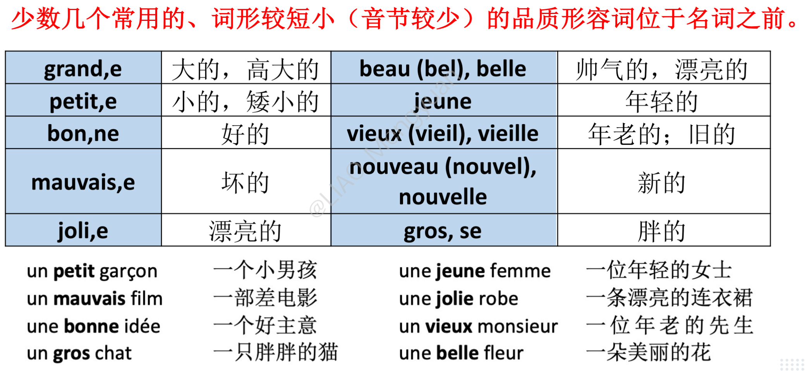
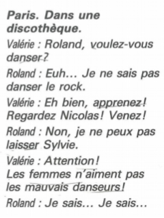
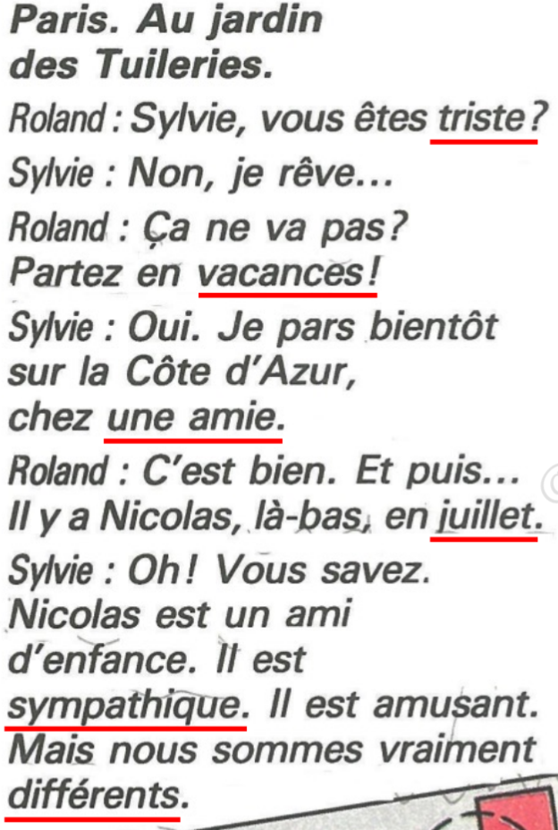

# 📘 Unité 1 Un printemps à Paris

### 否定冠词

**在否定句中，动词直接宾语前的不定冠词 un, une, des 用 de 代替。**

Ex：Il connaît **un** bon médecin.  -> Il ne connaît pas **de** bon médecin. 

> [!CAUTION]
>
> **1、de 用在否定句中，必须具备“否定”、“直接宾语”和“不定冠词”三个条件，缺一不可。**
> **2、动词如果是 être, 则不变 de。**
>
> **Ex：**
>
> J'aime le stylo.   -> Je n'aime pas le stylo.   （le 不是不定冠词）
>
> C'est un stylo.    -> Ce n'est pas un stylo.    （动词是 être）
>
> J'écris à un ami. -> Je n'écris pas à un ami.  （à un ami 是间接宾语）

----

### 命令式现在时

**只有tu，vous，nous三个人称的变位，与直陈式现在时相同；**

**否定结构为 Ne…pas**

> [!CAUTION]
>
> **第一组动词（-er结尾）在“Tu”变位时要去掉“s”，但是其它动词不用。**

----

### 形容词

| 法语                  | 中文    |
| :------------------ | :---- |
| grand(e)            | 大的    |
| petit(e)            | 小的    |
| clair(e)            | 明亮的   |
| sombre              | 昏暗的   |
| calme               | 安静的   |
| bruyant(e)          | 吵闹的   |
| isolé(e)            | 偏远的   |
| moderne             | 现代的   |
| ancien(ne)          | 古老的   |
| agréable            | 舒适的   |
| pratique            | 实用的   |
| vieux(vieille)      | 年老的   |
| jeune               | 年轻的   |
| gros(se)            | 胖的    |
| mince               | 瘦的    |
| beau(belle)         | 好看的   |
| gentil(le)          | 贴心的   |
| courageux(~~x~~ se) | 勇敢的   |
| intéressant(e)      | 有趣的   |
| amussant(e)         | 有趣的   |
| antipathique        | 引起反感的 |
| méchant(e)          | 凶狠的   |
| mécontent(e)        | 不高兴的  |
| bête                | 愚蠢的   |
| timide              | 害羞的   |
| ennuyeux(~~x~~ se)  | 无聊的   |
| triste              | 悲伤的   |
| sympathique         | 给人好感的 |

**特殊形容词根据名词词头变化：**

**vieux**  阳性单数，元音/哑音h $\Rightarrow$ **vieil**

**beau** 阳性单数，元音/哑音h $\Rightarrow$ **bel**

**nouveau**（新的）阳性单数，元音/哑音h $\Rightarrow$ **nouvel**

**性数配合：**

**阴性单数：**1. 词尾+e ；2. 以e结尾不变 ；3. s/x变sse 。

**复数：**1. 词尾+s ；2. -eau+x ；3. -s/-x 不变 ；4. -al变为-aux ( national->nationaux )

----

###　否定疑问句

**根据事实回答，是＝si，否=non。**

ex：

Tu **ne** viens **pas** déjeuner ?

**Si**, je viens.  / **Non**, je ne viens pas.

----

### 疑问词

|                         法语                          | 中文                |
| :---------------------------------------------------: | ------------------- |
|                **Qui** (Qui est-ce ?)                 | 谁(who)             |
|                 **Où** (Où vas-tu ?)                  | 哪里(where)         |
|            **Quand** (Quand partez-vous ?)            | 何时(when)          |
| **Que / Quoi** (Qu'est-ce que c'est ? / C'est quoi ?) | 什么(what)          |
|                     **Pourquoi**                      | 为什么(why)         |
|           **Quel (Quelle, Quels, Quelles)**           | 哪一个，什么(which) |
|                      **Combien**                      | 多少(how much)      |

**Quel 哪个/哪些；什么**

**Ex 1 : Quel + 名词**

**1. Quel âge avez-vous ? 你几岁了？**

- J'ai 20 ans. 我20岁。
- Il a 22 ans aujourd'hui. 他今天22岁了。
- Il a bientôt 10 ans. 他很快就10岁了。

**2. Quelle langue parlez-vous ? 你会说哪些语言？**

- Je parle chinois, anglais et français. 我讲中文、英文和法语。

**3. Quelle heure est-il ? 现在几点？**

- Il est onze heures et quart. 现在十一点一刻。

**4. Quelle date sommes-nous ? 今天几号？**

- Nous sommes le jeudi 27 novembre. 今天是11月27日星期四。

**5. Quels livres lisez-vous ? 您在读什么书？**

- Je lis les romans de Victor Hugo.

**6. Quelles villes préférez-vous ? 您更喜欢哪些城市？**

- Je préfère Paris, Nice et Lyon.

----

### 课文

| 法语                    | 中文           |
| ----------------------- | -------------- |
| dans                    | 在…里面        |
| vouloir                 | 想要           |
| Je ne sais pas + *inf.* | 我不会做某事   |
| apprendre               | 学习           |
| Je ne peux pas + *inf.* | 我不能做某事   |
| laisser                 | 留下，放下，让 |
| attention               | 注意，当心     |

**dans *prep.* 在…里面**

dans la maison 在家，在房子里

dans le sac 在包里

dans la rue 在路上

**laisser 留下，放下，让**

Laisse tomber 算了吧

Je vous laisse. / Je te laisse. 我先告辞了。

| 法语                   | 中文                 |
| ---------------------- | -------------------- |
| sur le port            | 在港口               |
| voir                   | 看见                 |
| si                     | 是的                 |
| Qu'est-ce qu'on fait ? | 咱们做什么?          |
| On y va.               | 咱们走.              |
| Bien sûr !             | 当然                 |
| le grand brun          | 那个高个子的褐发男子 |

**Voir 看见，面见** 

Je vais voir mon ami demain. 明天我要去见我的朋友。

Tu vois ? 你懂了吗？ Oui, je vois. 我懂了。

**Qu’est-ce que…… 什么**
Qu’est-ce que c’est ? 这是什么？
Qu’est-ce qu’on fait ? 咱们做什么？
Qu’est-ce qu’on mange ce soir ? 咱们今晚吃什么？
Qu’est-ce que tu veux ? 你想要什么？
Qu’est-ce qu’il y a dans ce sac ? 这个包里有什么？

| 法语               | 中文                 |
| ------------------ | -------------------- |
| jardin          | 花园       |
| triste       | 悲伤的     |
| rêver              | 做梦，幻想              |
| partir en vacances | 开启度假    |
| bientôt            | 马上，不久         |
| et puis            | 然后                 |
| là-bas             | 在那儿 |
| un ami d'enfance | 童年的朋友 |
| sympathique | 给人好感的 |
| vraiment | 真的，的确 |

**Ça ne va pas ? 你不好吗？**

**Ça va mal. 我不好。**

**là-bas 在那儿**

Il y a un café là-bas. 那里有一家咖啡馆。

Il y a des amis là-bas. 那里有一些朋友。 

**vraiment adv. 的确，真的 修饰形容词**

C'est vraiment intéressat. 这真的很有趣。

Elle est vraiment belle. 她真的很漂亮。

