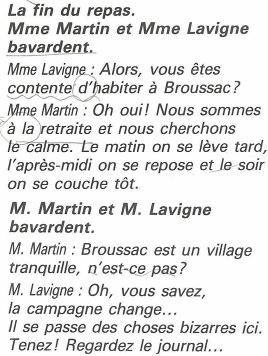
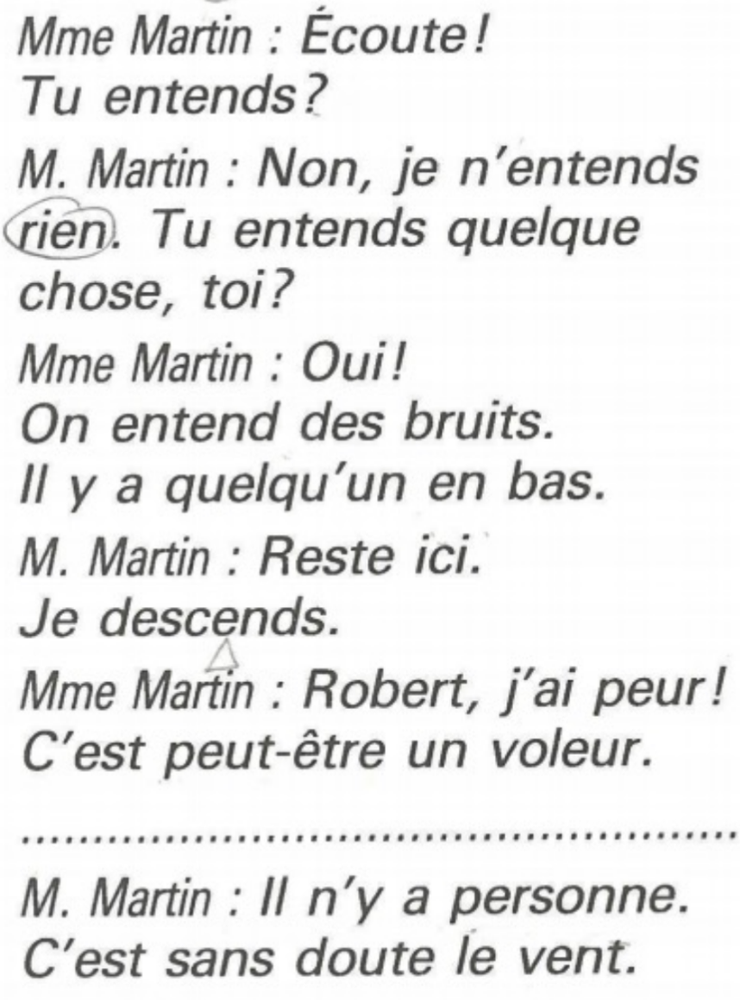

## 📘 Unité 2 Leçon 1 La maison de campagne

### 语法点一：指示形容词

| 法语           | 中文             | 备注                    |
| :------------- | :--------------- | :---------------------- |
| ce             | 这个（阳性单数） | 用于辅音开头名词        |
| cet            | 这个（阳性单数） | 用于元音或哑音h开头名词 |
| cette          | 这个（阴性单数） |                         |
| ces            | 这些（复数）     |                         |
| ce matin       | 今天早上         |                         |
| cet après-midi | 今天下午         |                         |
| ce soir        | 今天晚上         |                         |

### 语法点二：位置表达

| 法语            | 中文    |
| :-------------- | :------ |
| devant          | 在…前面 |
| derrière        | 在…后面 |
| à gauche (de)   | 在…左边 |
| à droite (de)   | 在…右边 |
| entre           | 在…之间 |
| sur             | 在…上面 |
| sous            | 在…下面 |
| au-dessus (de)  | 在…上方 |
| au-dessous (de) | 在…下方 |
| au bord (de)    | 在…边缘 |
| à côté (de)     | 在…旁边 |

### 房屋与家具

| 法语              | 中文     |
| :---------------- | :------- |
| un appartement    | 公寓     |
| une maison        | 房子     |
| une villa         | 别墅     |
| un studio         | 单间公寓 |
| la chambre        | 卧室     |
| la cuisine        | 厨房     |
| le salon          | 客厅     |
| la salle à manger | 餐厅     |
| la salle de bains | 浴室     |

### 对话与课文词汇

| 法语            | 中文     |
| :-------------- | :------- |
| visiter         | 参观     |
| un propriétaire | 房东     |
| un parc         | 公园     |
| une rivière     | 河流     |
| un endroit      | 地方     |
| magnifique      | 壮观的   |
| le silence      | 寂静     |
| isolé(e)        | 偏僻的   |
| pas du tout     | 一点也不 |
| un kilomètre    | 公里     |
| un bâtiment     | 建筑物   |
| une grange      | 谷仓     |

------

## 🍽️ Unité 2 Leçon 2 Repas à Broussac

### 语法点一：重读人称代词

| 法语  | 对应主语代词 | 中文    |
| :---- | :----------- | :------ |
| moi   | Je           | 我      |
| toi   | Tu           | 你      |
| lui   | Il           | 他      |
| elle  | Elle         | 她      |
| nous  | Nous         | 我们    |
| vous  | Vous         | 你们/您 |
| eux   | Ils          | 他们    |
| elles | Elles        | 她们    |

### 表达“我也是/我也不”

| 法语          | 中文             | 用法                     |
| :------------ | :--------------- | :----------------------- |
| Moi aussi.    | 我也是。         | 用于肯定句后             |
| Moi non plus. | 我也不。         | 用于否定句后             |
| Moi si.       | 我倒是（喜欢）。 | 用于否定句后表达相反意见 |
| Moi non.      | 我可不。         | 用于肯定句后表达相反意见 |

### 语法点二：量词

| 结构        | 含义       | 接名词类型   |
| :---------- | :--------- | :----------- |
| un peu de   | 一点…      | 不可数名词   |
| beaucoup de | 很多…      | 可数/不可数  |
| quelques    | 几个，一些 | 可数名词复数 |

### 三餐与饮食

| 法语                | 中文   |
| :------------------ | :----- |
| le petit-déjeuner   | 早餐   |
| le déjeuner         | 午餐   |
| le dîner            | 晚餐   |
| le goûter           | 下午茶 |
| la viande           | 肉类   |
| le bœuf             | 牛肉   |
| le veau             | 小牛肉 |
| l’agneau            | 羊肉   |
| le poulet           | 鸡肉   |
| le canard           | 鸭肉   |
| le lapin            | 兔肉   |
| le poisson          | 鱼     |
| les légumes         | 蔬菜   |
| les carottes        | 胡萝卜 |
| les tomates         | 番茄   |
| les champignons     | 蘑菇   |
| les pommes de terre | 土豆   |
| le riz              | 米饭   |
| les œufs            | 鸡蛋   |
| une omelette        | 煎蛋卷 |
| le fromage          | 奶酪   |
| le dessert          | 甜点   |
| la glace            | 冰淇淋 |
| le gâteau           | 蛋糕   |
| la soupe            | 汤     |
| le potage           | 浓汤   |
| le pain             | 面包   |

### 部分冠词

| 法语                | 中文              | 用法             |
| :------------------ | :---------------- | :--------------- |
| du                  | （阳性单数）      | 如 du pain       |
| de la               | （阴性单数）      | 如 de la viande  |
| de l’               | （元音或哑音h前） | 如 de l’eau      |
| des                 | （复数）          | 如 des légumes   |
| je ne mange pas de… | 我不吃…           | 否定句中冠词变de |

### 点餐用语

| 法语                         | 中文               | 角色   |
| :--------------------------- | :----------------- | :----- |
| Le menu, s’il vous plaît.    | 请给我菜单。       | 客人   |
| Quel est le plat du jour ?   | 今日推荐菜是什么？ | 客人   |
| Je voudrais… / Je prends…    | 我想要…            | 客人   |
| Comme entrée…                | 作为前菜…          | 服务员 |
| Vous buvez… ?                | 您喝什么？         | 服务员 |
| L’addition, s’il vous plaît. | 请结账。           | 客人   |
| Bon appétit !                | 祝您好胃口！       | 通用   |

### 评价食物

| 法语              | 中文     |
| :---------------- | :------- |
| C’est délicieux ! | 很好吃！ |
| C’est excellent ! | 太棒了！ |
| C’est très bon.   | 很好。   |
| Ce n’est pas bon. | 不好吃。 |
| C’est mauvais.    | 很难吃。 |

### 其他词汇

| 法语                    | 中文     |
| :---------------------- | :------- |
| un chaudron             | 大锅     |
| une serpe               | 镰刀     |
| nettoyer                | 清洁     |
| être au régime          | 在节食   |
| goûter                  | 品尝     |
| la cuisine de la région | 地方菜   |
| encore                  | 还，再   |
| la charcuterie          | 熟食     |
| bourguignon(ne)         | 勃艮第的 |
| refuser                 | 拒绝     |
| un morceau              | 一块     |

------

## 🕰️ Unité 2 Leçon 3 Bruits et disparitions

### 语法点：代词式动词

**自反代词**

| 主语代词   | 自反代词 |
| ---------- | -------- |
| Je         | me       |
| Tu         | te       |
| Il/Elle/On | se       |
| Nous       | nous     |
| Vous       | vous     |
| Ils/Elles  | se       |

> [!IMPORTANT]
>
> **自反代词使用时后面动词正常变位。**

| 动词         | 中文           | 变位示例（je） |
| :----------- | :------------- | :------------- |
| se réveiller | 醒来           | je me réveille |
| se lever     | 起床           | je me lève     |
| se laver     | 洗漱           | je me lave     |
| s’habiller   | 穿衣           | je m’habille   |
| se coucher   | 上床睡觉       | je me couche   |
| se reposer   | 休息           | je me repose   |
| se promener  | 散步           | je me promène  |
| se passer    | 发生（无人称） | il se passe    |

### 日常生活词汇

| 法语                      | 中文       |
| :------------------------ | :--------- |
| avoir sommeil             | 困了       |
| dormir                    | 睡觉       |
| prendre le petit-déjeuner | 吃早餐     |
| partir travailler         | 去上班     |
| aller en cours            | 去上课     |
| rentrer au dortoir        | 回宿舍     |
| se doucher                | 淋浴       |
| manger à la cantine       | 在食堂吃饭 |
| écouter la radio          | 听广播     |
| regarder la télévision    | 看电视     |
| faire du sport            | 做运动     |
| surfer sur Internet       | 上网       |

**Ex.**

Il se réveille à 7 heures du matin. 他在早上7点醒来。

Je me lève à 7h30 du matin. 我在七点半起床。 lever 把…举起

À quelle heure est-ce que vous vous lavez? 您几点洗漱？ laver 洗

Je m'habille. 我穿上衣服。 s'habiller 自己穿衣打扮。

Ils se reposent l'après-midi. 他们下午休息。 se reposer 休息 reposer 放回

Nous nous promenons à 5h de l'après-midi. 我们下午五点一起散步。 se promener (自己)散步 promener 领着…散步

Elles se couche à 10h du soir. 她晚上10点上床睡觉。 coucher 使…睡下

> [!IMPORTANT]
>
> **aime / voudrais 等单词之后使用自反代词，动词使用原形，自反代词还是和主语配合。**
>
> 例：Elle n'aime pas se réveiller tôt. 她不喜欢很早醒来。

**一天的流程：**

### 文化休闲活动

| 法语             | 中文     |
| :--------------- | :------- |
| aller au concert | 去音乐会 |
| aller au cinéma  | 去电影院 |
| aller au musée   | 去博物馆 |
| aller au théâtre | 去剧院   |

### 社会新闻词汇

| 法语                       | 中文           |
| :------------------------- | :------------- |
| un vol                     | 偷窃           |
| un cambriolage             | 入室盗窃       |
| un voleur                  | 小偷           |
| un assassinat / un meurtre | 谋杀           |
| un assassin / un meurtrier | 凶手           |
| perdre                     | 丢失           |
| **chercher**               | **寻找**       |
| **rechercher**             | **搜寻，追踪** |
| **trouver**                | **找到**       |

------

## Unité 2 Leçon 4 Déguisements

### 服饰

| 法语               | 中文 |
| ------------------ | ---- |
| un costume         | 西服套装 |
| un blouson         | 夹克 |
| un chapeau         | 帽子 |
| un manteau         | 大衣 |
| un pull-over(pull) | 羊毛 |
| un pantalon        | 裤子 |
| un chemisier       | 女式衬衫 |
| une chemise        | 男士衬衫 |
| une veste          | 上衣 |
| une cravate | 领带 |
| une  ceinture | 皮带 |
| une écharpe | 围巾，披肩 |
| une jupe | 半身裙 |
| une robe | 长裙 |
| une chaussette | 袜子 |
| une chaussure | 鞋 |
| une botte | 靴子 |

### 风格

#### Le stylo

| 法语           | 中文   |
| -------------- | ------ |
| à la mode      | 时尚的 |
| classique      | 经典的 |
| long(longue)   | 长的   |
| court(courte)  | 短的   |
| large          | 宽松的 |
| étroit(e)      | 紧身的 |
| neuf(neuve)    | 新的   |
| vieux(vieille) | 旧的   |

----

## 📝 动词变位总结（部分）

### 第一组动词 (-er)

| 动词       | 中文     |
| :--------- | :------- |
| parler     | 说话     |
| habiter    | 居住     |
| travailler | 工作     |
| manger     | 吃       |
| acheter    | 购买     |
| visiter    | 参观     |
| nettoyer   | 清洁     |
| goûter     | 品尝     |
| commander  | 点餐     |
| appeler    | 叫，称呼 |

### 第二组动词 (-ir)

| 动词    | 中文 |
| :------ | :--- |
| finir   | 完成 |
| choisir | 选择 |

### 第三组动词（不规则）

| 动词      | 中文   |
| :-------- | :----- |
| être      | 是     |
| avoir     | 有     |
| aller     | 去     |
| faire     | 做     |
| vouloir   | 想要   |
| pouvoir   | 能够   |
| venir     | 来     |
| prendre   | 拿，吃 |
| boire     | 喝     |
| lire      | 读     |
| écrire    | 写     |
| voir      | 看见   |
| dire      | 说     |
| connaître | 认识   |
| savoir    | 知道   |
| dormir    | 睡觉   |

------

## 🧩 实用表达与句型

| 法语                              | 中文           | 使用场景 |
| :-------------------------------- | :------------- | :------- |
| Qu’est-ce que c’est ?             | 这是什么？     | 询问物品 |
| Qu’est-ce qui se passe ?          | 发生什么事了？ | 询问事件 |
| Il y a…                           | 有…            | 存在句   |
| Je voudrais…                      | 我想要…        | 礼貌请求 |
| C’est pour combien de personnes ? | 几位？         | 餐厅询问 |
| Vous avez une réservation ?       | 您有预订吗？   | 餐厅询问 |
| C’est tout.                       | 就这些。       | 点餐结束 |

### 📖 课文

| 法语               | 中文           |
| ------------------ | -------------- |
| la fin             | 结尾，终点     |
| bavarder           | 聊天           |
| content(e)         | 高兴的，满意的 |
| être content(e) de | 对…感到满意    |
| être à la retraite | 退休           |
| chercher           | 寻找           |
| le calme           | 安静，宁静     |
| tard / tôt         | 迟/早          |
| tranquille | 安静的 |
| n'est-ce pas ? | 不是吗？ |
| changer | 改变 |
| se passer | 发生 |
| bizarre | 奇怪的 |

**句型：**

**1.  Il se passe…** **无人称结构：“发生”**

eg: 

Il se passe quelque chose. 有事发生了。

Tout se passe bien au travail ? 工作一切顺利吗？

**2. ** **Qu’est-ce que & Qu’est-ce qui 对物提问，做宾语&主语**

eg:

Qu’est-ce que tu vois ? 你看到了什么？

Qu’est-ce qui se passe ? 发生了什么？

----

## 📚 Unité 2 Leçon 3 Bruits et disparitions

## 泛指代词

| 法语      | 英语    |
| --------- | ------- |
| quelqu'un | someone |
| quelque chose | something |
| ne…personne | nobody |
| ne…rien | nothing |

**Ex:**

- Tu void quelqu'un ?

  Non, je ne vois personne.

- Tu entends quelque chose ?

  Non, je n'entends rien. 

> [!CAUTION]
>
> **如果有助动词，否定代词用法同“ne…pas”！**
>
> eg：Je **ne** veux voir **personne**.

----

### 主有形容词

| 人称      | 阳性 | 元音/哑音h | 阴性 | 负数  |
| --------- | ---- | :--------- | :--- | ----- |
| 我的      | mon  | mon        | ma   | mes   |
| 你的      | ton  | ton        | ta   | tes   |
| ta的      | son  | son        | sa   | ses   |
| 我们的    | notre | notre | notre | nos   |
| 你们/您的 | votre | votre | votre | vos   |
| ta们的    | leur | leur | leur | leurs |

> [!CAUTION]
>
> **主有形容词与限定的名词性数配合，与所有者性别无关！**

----

### 课文

| 法语       | 中文           |
| ---------- | -------------- |
| entendre   | 听见           |
| en bas     | 在楼下，在下面 |
| en haut    | 在楼上，在上面 |
| monter     | 上楼，上去     |
| descendre  | 下楼，下去     |
| peut-être  | 或许，可能     |
| sans doute | 很可能         |
| le vent    | 风             |
| une boîte | 盒子 |
| un outil | 工具 |
| une boîte à outils | 工具箱 |
| autre(s) | 其他的，另一个 |
| Mon Dieu ! | 我的上帝 |
| bruit(s) | 噪音 |

