# Electric Machinery
---
## I. Electric Machinery Principles

Speed: $\omega_m$ (rad/s) $\rightarrow f_m = \frac{\omega_m}{2\pi} \cdot n$ (per min) $\rightarrow n_m = 60 f_m$, $1 \text{ RPM} = \frac{\pi}{30} \text{ rad/s}$

Torque: Torque is counterclockwise!
**$\vec{\tau} = \vec{F} \times \vec{r} = J \cdot \vec{\alpha}$** $\swarrow$ $\vec{\alpha} = \frac{d\vec{\omega}}{dt}$
$\tau = F \cdot r \cdot \sin\theta$
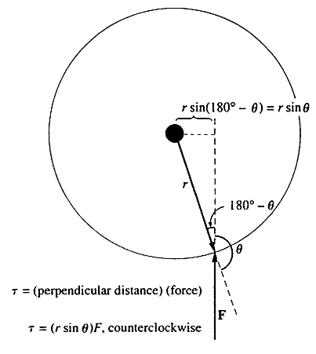

Work: **$W = \int_{\theta_1}^{\theta_2} \tau d\theta = \tau \cdot \theta$**

Power: **$P = \frac{dW}{dt} = \tau \frac{d\theta}{dt} = \tau \cdot \omega$**

watts & horsepower: $1 \text{ hp} = 746 \text{ W}$

The magnetic field:

$\oint_c \vec{H} \cdot d\vec{l} = \int_s \vec{J} \cdot d\vec{a} = I_{net}$   - Ampere's Law

$\oint_s \vec{B} \cdot d\vec{a} = 0$                      - MF's Gausses' Law

$\Rightarrow$ To simplify, we have a 1-D circuit equivalent of MF:
    **Magnetic circuit**

---

### § Simple Magnetic Circuit

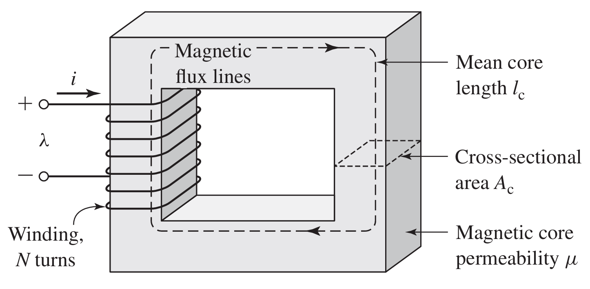

For a really high $\mu$: magnetic flux will be confined to the paths defined by the structure.
Thus, we can use magnetic circuit to simplify this model.

**Details:**

* The source of MF ($I_{net}$), **$\mathscr{F} = N \cdot i$**
  we call $\mathscr{F}$ as magnetomotive force (mmf)
  For multiple windings: $\mathscr{F} = N_1 \cdot i_1 + N_2 \cdot i_2 + \cdots$
* Magnetic flux: $\phi = \int_s \vec{B} \cdot d\vec{a}$ (Wb)
  Simplify as MC: **$\phi_c = B_c \cdot A_c$**
  $\phi_c$: core flux, $B_c$: core flux density
* mmf: According to Ampere's Law:
  $\mathscr{F} = I_{net} = \oint \vec{H} \cdot d\vec{l}$
  For MC: $\vec{H} \approx \vec{H}_c$, $l \approx l_c$, so:
  **$\mathscr{F} = N \cdot i = H_c \cdot l_c$** $\Rightarrow$ **$H_c = \frac{Ni}{l_c}$**
* $\vec{H}$ & $\vec{B}$: $\vec{B} = \mu\vec{H} \Rightarrow B = \mu \frac{Ni}{l_c}$

☆ **Magnetic Circuit V.S. Electric Circuit**

$\phi_c = B_c A_c = \mu \frac{Ni}{l_c} A_c$  	$\sim$	 $I = J \cdot a$

$\mathscr{F} = N \cdot i = H \cdot l$		$\sim$ 	$V = E \cdot l$

$\mathscr{R} = \frac{\mathscr{F}}{\phi_c} = \frac{l_c}{\mu A_c}$		     $\sim$	 $R = \frac{V}{I} = \rho \frac{l}{A}$

Magnetic analogue to Kirchhoff's Law:

Divergence of $\vec{B} = 0$   ($\nabla \cdot \vec{B} = 0$)

Total flux entering one node is 0.

Reluctance of MC:
Series: $\mathscr{R} = \mathscr{R}_1 + \mathscr{R}_2 + \mathscr{R}_3 + \cdots$
Parallel: $\frac{1}{\mathscr{R}} = \frac{1}{\mathscr{R}_1} + \frac{1}{\mathscr{R}_2} + \frac{1}{\mathscr{R}_3} + \cdots$

---

**The errors in MC computation:**

* There is a small fraction of the flux escapes from the core into the air. The flux outside is called **leakage flux**.
* The assumption of $l = l_c$ is not really very good, especially at corners.
* In ferromagnetic materials, the $\mu$ varies with the amount of flux already inside. Thus, the effect is always **nonlinear**.
* Air gap "fringing effect".

---

### § Magnetic Circuit with Air Gap

Provided $g$ is sufficiently small, we can analyze this as two series components.

Ignoring the leakage: $\phi_c = \phi_g = \phi$

$\mathscr{F} = Ni = \oint \vec{H} \cdot d\vec{l}= H_c l_c + H_g g = \frac{B_c}{\mu} l_c + \frac{B_g}{\mu_0} g$

$\Rightarrow$ **$\mathscr{F} = \phi (\frac{l_c}{\mu A_c} + \frac{g}{\mu_0 A_g})$**

$\Rightarrow$ verify the $\mathscr{R}$ series' law:

**$\mathscr{R} = \mathscr{R}_c + \mathscr{R}_g = \frac{l_c}{\mu A_c} + \frac{g}{\mu_0 A_g}$**

As $\mu$ is relatively much higher than $\mu_0$ ($2000 \sim 80000$ times), $\mathscr{R}_g \gg \mathscr{R}_c$

$\mathscr{R} \approx \mathscr{R}_g$, **$\phi \approx Ni \frac{\mu_0 A_g}{g}$**

---

As we mentioned before, $\mu$ in the core will change with flux inside. But with $\phi \approx Ni \frac{\mu_0 A_g}{g}$, its variation won't significantly affect the performance of MC, because the dominant $\mathscr{R}$ is that in air gap.

☆ Fringing effect: why $A_g \neq A_c$?
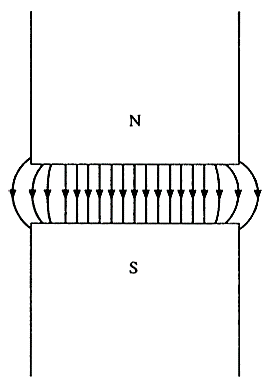
The fringing effect causes $A_g$ to increase, so there is always $A_g > A_c$.
If fringing is neglected, $A_g = A_c$.

---

### § Magnetic behavior of ferromagnetic materials
- Saturation

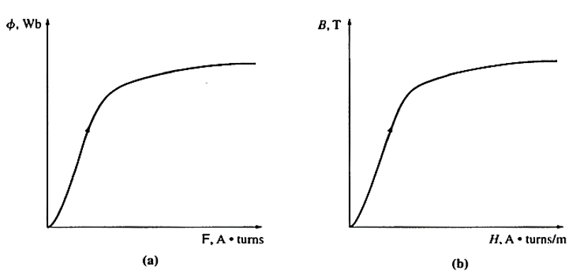

| $\phi = Ni \frac{\mu A}{l}$                 | $B = \mu H$                                 |
| ------------------------------------------- | :------------------------------------------ |
| $\mathscr{F} = Ni \uparrow, \mu \downarrow$ | $H = \frac{Ni}{l} \uparrow, \mu \downarrow$ |

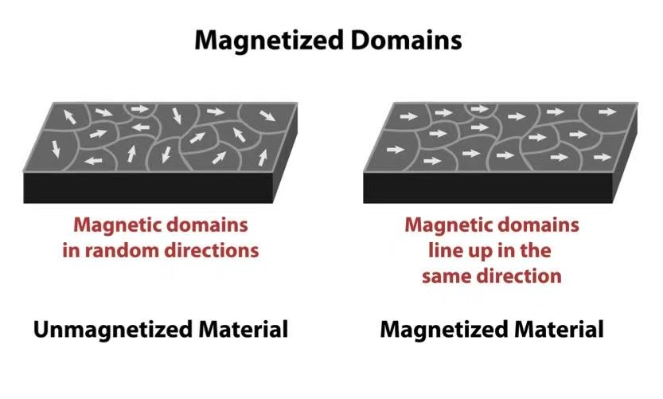

Saturation occurs when all the magnetic domains in a material are all aligned together. When the temperature reaches Curie Point ($T_c$), the domains will be reoriented and $\mu$ will decrease sharply.

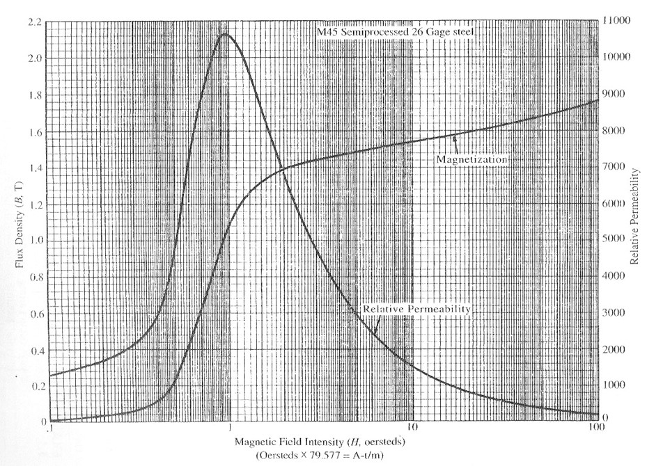

---

At first, $H \uparrow \rightarrow B \uparrow \uparrow, \mu_r \uparrow$;

Then, most of domains lined up, $\mu_r$ saturate as $\mu_{r \max}$;

Finally, $H \uparrow \uparrow \rightarrow B \uparrow, \mu_r \downarrow$, no more domains can contribute to the increase of $B, \mu \rightarrow \mu_0, \mu_r \rightarrow 1$.

**Energy loss in ferromagnetic core**

**Hysteresis Loss**

When a ferromagnetic material is subjected into an alternating MF, $B$ always lags behind $H$, which is called Hysteresis.
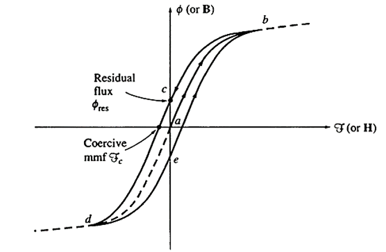

**Root causes:**

1) Friction of domain rotation;
2) Domain wall pinning (impurities, $\dots$);
   These effects above cause the process of magnetization to be irreversible.
   When $H$ removed, some domains stay aligned, creating Remanence.

**The effect of mmf on the loop**
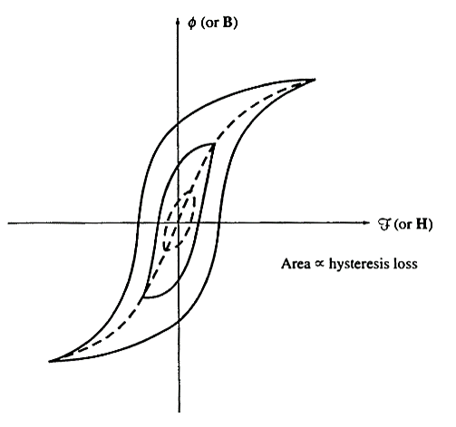
As $\mathscr{F} = Ni$ increasing, the loop grows taller and wider to reach the saturation point. This means hysteresis loss is higher as it equals to the area of the loop.

---

How to calculate Hysteresis Loss?

**$W = A_c l_m \int_{\text{one cycle}} H dB$**

$A_c$: cross-section area

$l_m$: mean magnetic path length

$A_c l_m = \text{Volume of the core}$

The integral is the area of B-H Loop.

Proof: $W = \int v(t)i(t)dt$

Faraday's Law: $v(t) = N \frac{d\Phi}{dt} = N A_c \frac{dB(t)}{dt}$

Ampere's Law: $H(t) l_m = N i(t) = \mathscr{F}$

Thus, $W = A_c l_m \int_{\text{one cycle}} H dB$ is proved.

Then, as for the power:
**$P = f \cdot A_c l_m \int_{\text{one cycle}} H dB$**

---

### § Faraday's law

Induced voltage magnitude and polarity
$$
\begin{cases}
e_i = -\frac{d\phi}{dt} \\
e_{ind} = \sum_{i=1}^{N} e_i
\end{cases}
$$
$N$: turns of wires

$\phi$: flux passing through coils

$\Rightarrow$ **$e_{ind} = -N \frac{d\phi}{dt}$**

Polarity - Lenz's Law
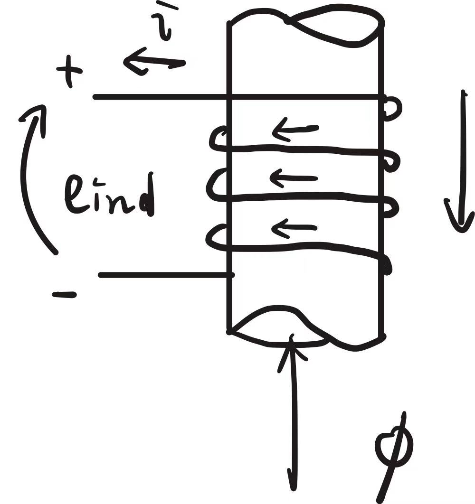
Direction of opposing flux $\phi$ increasing.

---

**Flux and flux linkage**

For $e_{ind} = N \frac{d\phi}{dt} = \frac{d(N\phi)}{dt}$, the term in parentheses is called the flux linkage $\lambda$ of the coil.

Thus:

**$e_{ind} = \frac{d\lambda}{dt}$**, where **$\lambda = \sum_{i=1}^{N} \phi_i$**

Unit of $\lambda$: Wb (or Weber-turns)

Produce an induced force on a wire
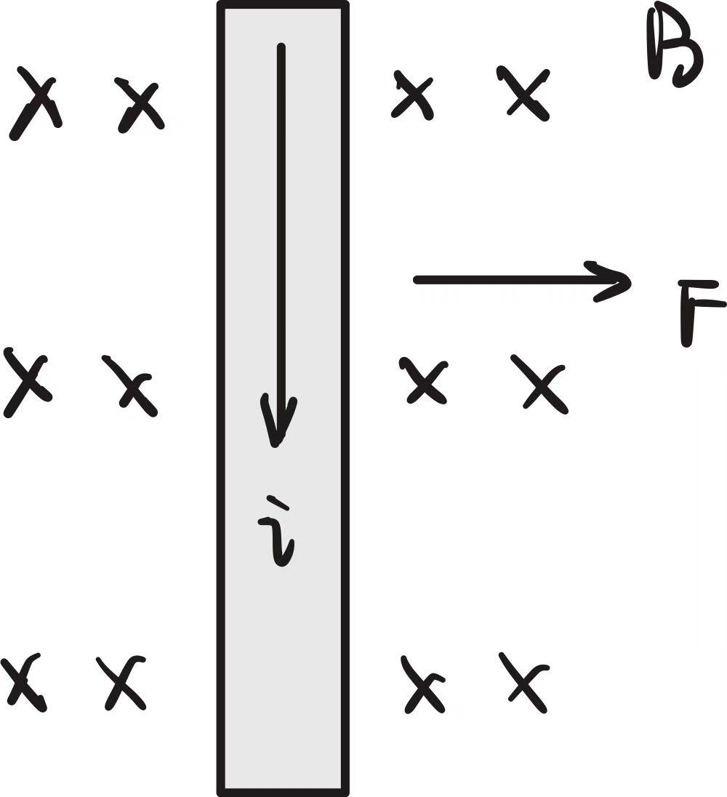

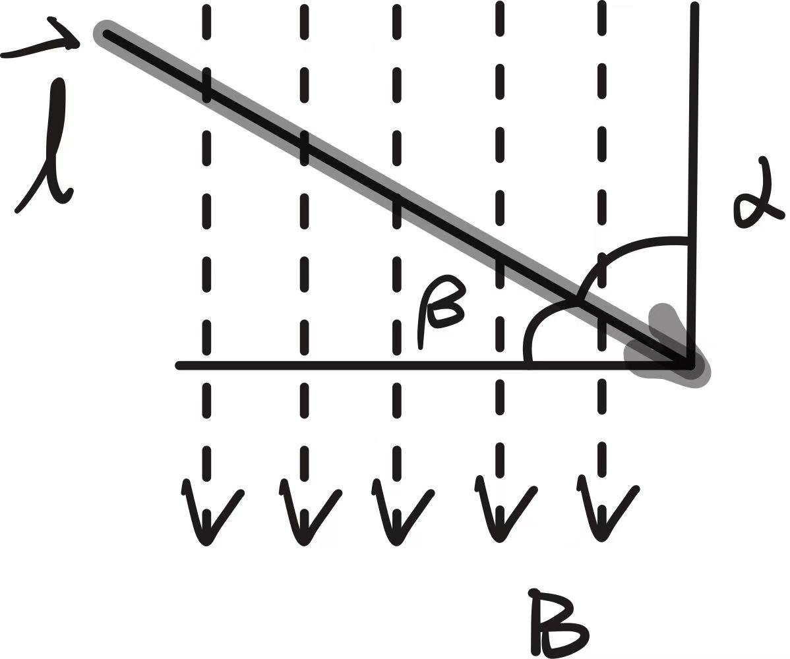

**$\vec{F} = i(\vec{l} \times \vec{B})$**
$F = i l B \sin\alpha$

---

**Flux bunching**

flux flowing in the same direction are the same polarity and repel each other. flux flowing in the opposite direction are of opposite polarity and attract each other.
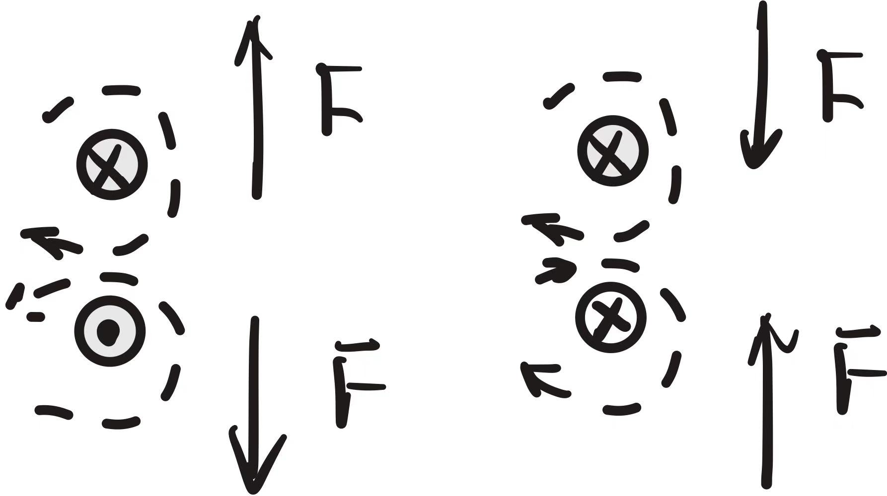 
**Flux refuses to bunch!**

Application of flux bunching

Motor Action
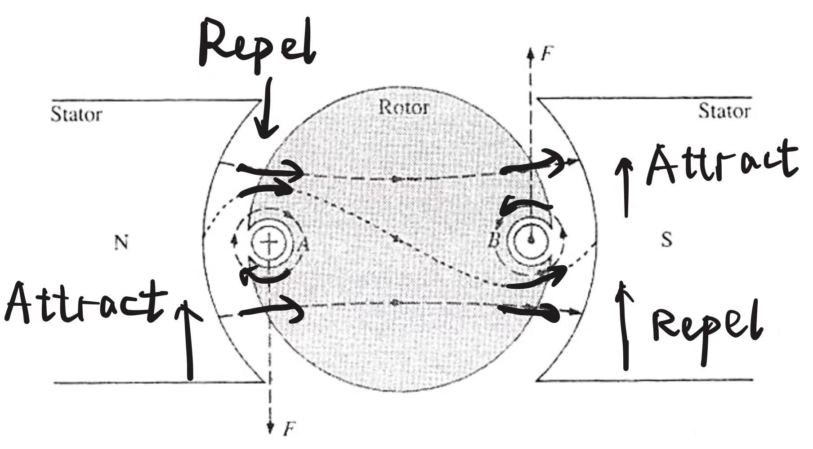
Counterclockwise rotation is generated from flux bunching.

---

### § Torque using a simplified diagram

$d$: distance between the center of the shaft and the center of conductor.

For each coil side:  $F = B i l \cos \beta$ 

(Considering Radial MF)

Torque: $T_D = 2 F d = 2 B i l d \cos\beta$ (N·m)

---

### § The Linear DC machine

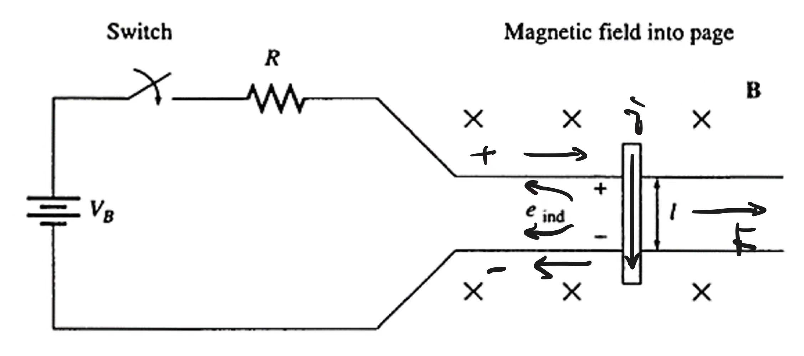

$\vec{F} = i(\vec{l} \times \vec{B})$

The voltage induced on a wire moving in B:

$e_{ind} = (\vec{v} \times \vec{B}) \cdot \vec{l}$

Thus:
$$
\begin{cases}
V_B = e_{ind} + iR = 0 \\
F_{net} = ma
\end{cases}
$$
$i = \frac{V_B - B l v}{R}$, $F = B i l = ma$

$v \uparrow, i \downarrow, a \downarrow, v \rightarrow v_{ss}$

**$v_{ss} = V_B / B l$**

---

Linear DC motor while a load is applied

$P_{conv} = e_{ind} \cdot i = F_{ind} v$

A force $F_{load}$ is applied opposite to $\vec{v}$ and $F_{net}$ is negative now.

$v \downarrow$, $e_{ind} = B l v \downarrow$, $i \uparrow$, $F_{ind} \uparrow$

until $F_{ind} = F_{load} = 0$

$\frac{V_B - B l v'_{ss}}{R} B l = F_{load}$

$\Rightarrow$ **$v'_{ss} = \frac{B L V_B - F_{load} R}{B^2 l^2} = v_{ss} - \frac{F R}{B^2 l^2}$**

---

Sinusoidal current flow from motion

---

## II. Transformers
Types and construction
* Core-form:
  consists a simple rectangular laminated piece of steel with the transformers windings wrapped around two sides.
* Shell-form:
  consists three legs laminated core with winding wrapped around the center leg.

Core-form  |  Shell-form

---

* Primary winding or input winding:
  The winding connected to the power source.
* Secondary winding or output winding:
  The winding connected to the loads.

* Core material and eddy current:
  The core is constructed of thin laminations electrically isolated from each other in order to minimize the eddy current.
* Eddy current:

---

### § Ideal Transformer
* Assumptions
  Neglect: Leakage flux, copper losses, hysteresis losses, eddy-current losses.

* Characteristics
  
  $\frac{v_p(t)}{v_s(t)} = \frac{N_p}{N_s} = a$

Energy balance:
$N_p i_p(t) = N_s i_s(t)$
$\frac{i_p(t)}{i_s(t)} = \frac{N_s}{N_p} = \frac{1}{a}$

Phasor relation:
$\frac{\dot{V}_p}{\dot{V}_s} = a$, $\frac{\dot{I}_p}{\dot{I}_s} = \frac{1}{a}$
The turns ratio $a$ only effects the magnitude not the angle.

---

* Dot convention
  If the primary current flows into the dotted end of the primary winding, the secondary current will flow out of the dotted end of the secondary winding.

* Power:
  $P_{in} = V_p I_p \cos\theta_p$, $P_{out} = V_s I_s \cos\theta_s$
  Since the transformer can't change the angles, the primary and secondary windings have the same power factor.
  Power, reactive power, apparent power are all the same for input and output.
  $P_{in} = P_{out}$, $Q_{in} = Q_{out}$, $S_{in} = S_{out}$

---

* Impedance transformation
  
  $\dot{V}_p = a \dot{V}_s$
  $\dot{I}_p = \frac{1}{a} \dot{I}_s$
  $\dot{Z}'_L = \frac{\dot{V}_p}{\dot{I}_p} = a^2 \frac{\dot{V}_s}{\dot{I}_s}$
  $\Rightarrow$ **$\dot{Z}'_L = a^2 Z_L$**

Transformer Quantities

---

Reference Direction
* Current, Voltage, Flux and EMF

Primary Winding  |  Secondary Winding

* Current, Flux  |  EMF, Mutual Flux

---

### § No load operation of transformers
$\dot{U}_1 \rightarrow \dot{I}_0 \rightarrow \dot{\mathscr{F}}_0 = N_1 \dot{I}_0 \rightarrow \dot{\Phi}_m \rightarrow \begin{cases} \dot{E}_{\sigma 1} \\ \dot{E}_1 \\ \dot{E}_2 \end{cases}$
Electric $\rightarrow$ Magnetic $\rightarrow$ Electric

Mutual Magnetic Flux:
$\phi = \Phi_m \sin\omega t$, $\Phi_m$: Wb, $\omega$: rad/s

Induced EMF by Mutual Flux:
$e_1 = -N_1 \frac{d\phi}{dt}$, $e_2 = -N_2 \frac{d\phi}{dt}$

Emf on Primary winding:
$e_1 = -\omega N_1 \Phi_m \cos\omega t = E_{1m} \sin(\omega t - 90^\circ)$
Emf on Secondary winding:
$e_2 = -\omega N_2 \Phi_m \cos\omega t = E_{2m} \sin(\omega t - 90^\circ)$

---

Emf Phasor:
$\dot{E}_1 = -j \frac{1}{\sqrt{2}} \omega N_1 \dot{\Phi}_m = -j \sqrt{2} \pi \omega N_1 \dot{\Phi}_m$
**$\dot{E}_1 = -j 4.44 f N_1 \dot{\Phi}_m$**
Thus,
**$\dot{E}_2 = -j 4.44 f N_2 \dot{\Phi}_m$**

Neglecting leakage and losses:
$\dot{U}_1 = -\dot{E}_1 = j 4.44 f N_1 \dot{\Phi}_m = Z_m \cdot \dot{I}_0$

---

### § Loaded operation of transformers

$\dot{E}_1 = -j \frac{1}{\sqrt{2}} \omega N_1 \Phi_m = -j 4.44 f N_1 \Phi_m$
$\dot{E}_2 = -j \frac{1}{\sqrt{2}} \omega N_2 \Phi_m = -j 4.44 f N_2 \Phi_m$
$\frac{\dot{E}_1}{\dot{E}_2} = \frac{N_1}{N_2} = a$
The same as no load operation.

What has changed? Mmf.
No load: $\dot{\mathscr{F}}_0 = N_1 \dot{I}_0 = \dot{\Phi}_m \mathscr{R}_m$
Loaded: $\dot{\mathscr{F}}_1 = N_1 \dot{I}_1$, $\dot{\mathscr{F}}_2 = N_2 \dot{I}_2$
$\dot{\mathscr{F}}_m = \dot{\mathscr{F}}_1 + \dot{\mathscr{F}}_2$

---

Mmf under loaded condition is similar to the Mmf under no load condition.
**$\dot{\mathscr{F}}_m = \dot{\mathscr{F}}_0 = \dot{\Phi}_m \mathscr{R}_m$**
Why?
$\Phi_m$ is determined by $\dot{E}_1$ according to $\dot{E}_1 = -j 4.44 f N_1 \Phi_m$, so $\Phi_m$ stays the same under loaded condition.
Thus, $\dot{\mathscr{F}}_m = \dot{\Phi}_m \mathscr{R}_m = \dot{\mathscr{F}}_0$.
$\Rightarrow \dot{\mathscr{F}}_1 = \dot{\mathscr{F}}_0 + (-\dot{\mathscr{F}}_2)$
$N_1 \dot{I}_1 = N_1 \dot{I}_0 - N_2 \dot{I}_2$
Primary = Source - Secondary
$\Rightarrow$ **$\dot{I}_1 = \dot{I}_0 - \frac{N_2}{N_1}\dot{I}_2 = \dot{I}_0 - \frac{1}{a}\dot{I}_2$**
$\nwarrow$ Magnetic current     $\nearrow$ Load current

---

### § Real Transformers v.s. Ideal Transformers
* Leakage flux  |  * Hysteresis losses
* Copper losses  |  * Eddy-current losses

Voltage Relation derive from Faraday

Induced voltage: $\bar{\phi} = \frac{1}{N_p} \int v_p(t)dt$
Primary side flux: $\bar{\phi}_p = \phi_M + \phi_{LP}$
$\swarrow$ flux component linking both sides    $\searrow$ primary leakage
Secondary side flux: $\bar{\phi}_S = \phi_m + \phi_{LS}$

---

Induced voltage on primary side:
$v_p(t) = N_p \frac{d\bar{\phi}_p}{dt} = N_p(\frac{d\phi_m}{dt} + \frac{d\phi_{LP}}{dt})$
**$v_p(t) = e_p(t) + e_{Lp}(t)$**

Induced voltage on secondary side:
$v_s(t) = N_s \frac{d\bar{\phi}_S}{dt} = N_s(\frac{d\phi_m}{dt} + \frac{d\phi_{LS}}{dt})$
**$v_s(t) = e_s(t) + e_{Ls}(t)$**

Induced by mutual flux:
Primary voltage from $\bar{\phi}_m$: $e_p(t) = N_p \frac{d\bar{\phi}_m}{dt}$
Secondary voltage from $\bar{\phi}_m$: $e_s(t) = N_s \frac{d\bar{\phi}_m}{dt}$
Notice that: $\frac{e_p(t)}{N_p} = \frac{d\bar{\phi}_m}{dt} = \frac{e_s(t)}{N_s}$
Therefore: $\frac{e_p(t)}{e_s(t)} = \frac{N_p}{N_s} = a$
Since in a well-designed transformer $\phi_m \gg \phi_{Lp}$, $\phi_m \gg \phi_{LS}$, this is approximately correct.

---

Modeling the leakage flux by leakage inductance
$e_{Lp}(t) = N_p \frac{d\bar{\phi}_{Lp}}{dt}$, $e_{Ls}(t) = N_s \frac{d\bar{\phi}_{Ls}}{dt}$
$\bar{\phi}_{Lp} = \mathscr{P} N_p i_p$, $\bar{\phi}_{Ls} = \mathscr{P} N_s i_s$
[for every circuit: $Ni = N_L i_L$]
$\mathscr{P} = \frac{1}{\mathscr{R}}$ : permeance of flux path
Thus, $e_{Lp}(t) = N_p^2 \mathscr{P} \frac{di_p}{dt}$
$e_{Ls}(t) = N_s^2 \mathscr{P} \frac{di_s}{dt}$
The constants can be lumped together.
Then let: $L = N^2 \mathscr{P}$
$e_L(t) = L \frac{di}{dt}$

---

### § Theory of operation of real single-phase transformers

Secondary side open

* Secondary side is open circuit.
* Input voltage and current to measure hysteresis curve.
* Flux is proportional to $v_p$ and mmf is proportional to $i_p$.
* $i_p(t) = 0$ for ideal transformer.

---

Magnetization current in real transformers
1. The magnetization current $i_m$ is used to generate mutual flux $\phi_M$.
2. While secondary side is opened, the current measured at primary side contains two parts and is called excitation current $i_{ex}$, which includes:

* Magnetization current $i_m$:
  To generate mutual flux.
* Core loss current $i_{h+e}$:
  Hysteresis and eddy current.
* The magnetization current in the transformer is not sinusoidal.
  The higher-frequency components are due to magnetic saturation. ($i \uparrow \uparrow \Rightarrow \phi \uparrow \rightarrow$)

---

* The fundamental component of $i_m$ lags the voltage applied to the core by $90^\circ$.

Core-loss current

* The core-loss current $i_{h+e}$ is nonlinear because of the nonlinear effects of hysteresis.
* The fundamental component of $i_{h+e}$ is in phase with the voltage applied to the core.

Excitation current
We have **$i_{ex} = i_m + i_{h+e}$**, thus:

---

### § The equivalent circuit of non-ideal transformers
1> Copper losses. ($I^2R$, heating losses on windings)
2> Eddy current losses. (heating losses in the core)
3> Hysteresis losses.
4> Leakage flux. (self-inductance)

Modeling excitation current & copper losses
* **The hysteresis and eddy current** is in-phase with input voltage.
  $\Rightarrow$ Modeled as a shunt resistor **$R_c$**.
* **The magnetization current** is lagging input voltage by $90^\circ$.
  $\Rightarrow$ Modeled as a shunt inductor **$X_m$**.
* **The copper loss** can be modeled as series resistor **$R_p$ and $R_s$**.

---

The resulting equivalent circuit

Impedance transform to primary or secondary side

---

Approximate equivalent circuit

Neglecting excitation current

How to measure those parameters?
* Open circuit test - excitation branch
* Short circuit test - series branch

---

### § Open circuit test

Under the open circuit condition, all the input current flows through the excitation branch.
Thus, we have:
$$
\begin{cases}
Y_E = \frac{I_{oc}}{V_{oc}} \angle -\theta \\
\theta = \cos^{-1}\frac{P_{oc}}{V_{oc} I_{oc}} \\
PF = \cos\theta = \frac{P_{oc}}{V_{oc} I_{oc}}
\end{cases}
$$
$Y_E = G_c - j B_M = \frac{1}{R_c} - j\frac{1}{X_M}$

---

### § Short circuit test

At secondary side short circuit condition, the input voltage must be very low to prevent input large short circuit current.
$$
\begin{cases}
|Z_{SE}| = \frac{V_{sc}}{I_{sc}} \\
Z_{SE} = \frac{V_{sc}}{I_{sc}} \angle \theta^\circ \\
PF = \cos\theta = \frac{P_{sc}}{V_{sc} I_{sc}}
\end{cases}
$$
$Z_{SE} = R_{eq} + j X_{eq}$
$= (R_p + a^2 R_s) + j(X_p + a^2 X_s)$

---

### § Transformer voltage regulation and efficiency

Because a real transformer has series impedances within it, the load can influence the output voltage.
To conveniently compare transformers in this respect, we defined a quantity called voltage regulation (VR).
It's defined by the equation:
$$VR = \frac{V_{s,nl} - V_{s,fl}}{V_{s,fl}} \times 100\%$$

$V_{s,nl}$: No-load voltage of secondary side
Since at no load, $V_s = V_p / a$, thus:
$$VR = \frac{V_p/a - V_{s,fl}}{V_{s,fl}} \times 100\%$$