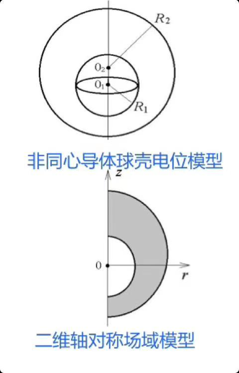
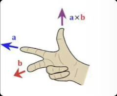
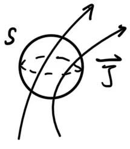
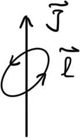
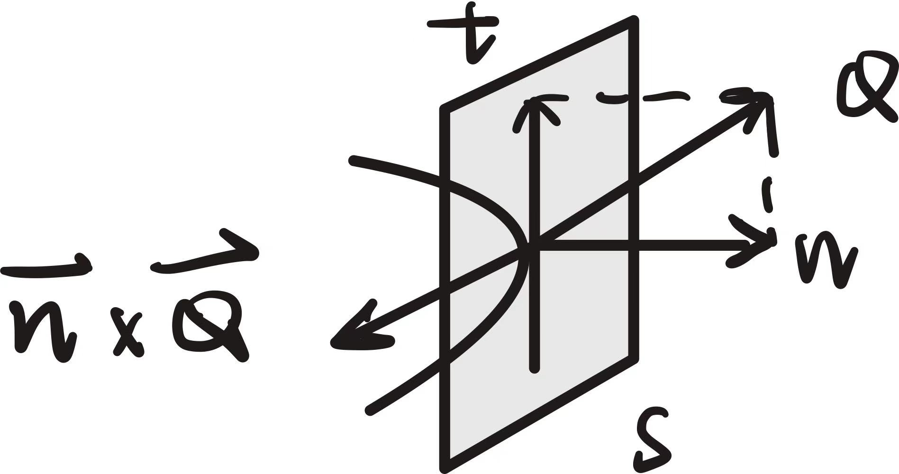
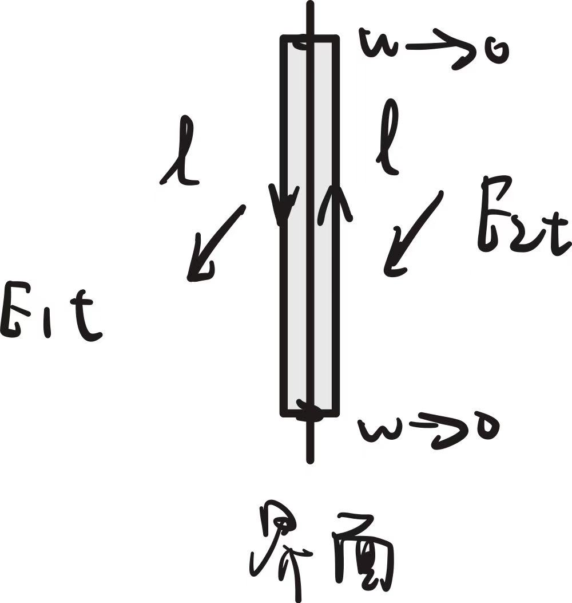
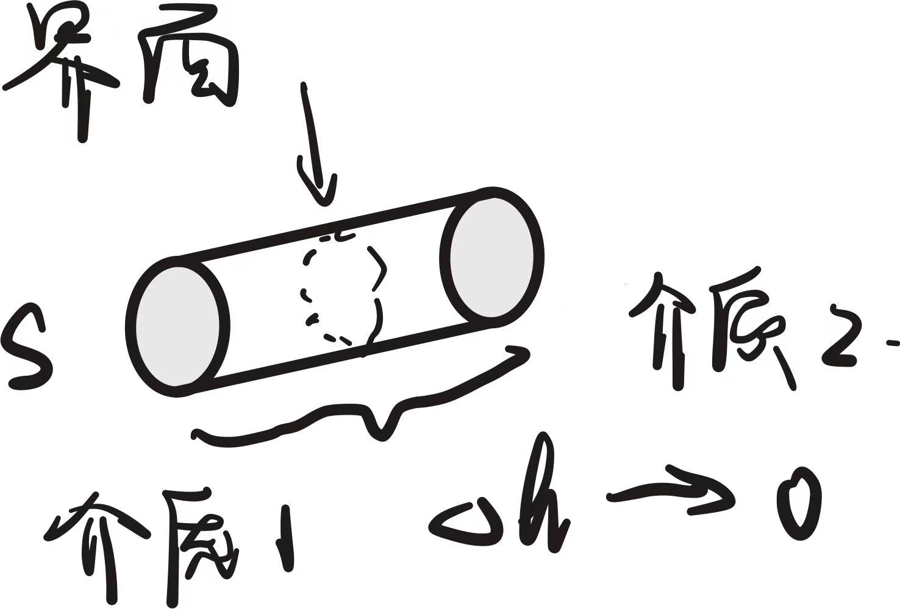
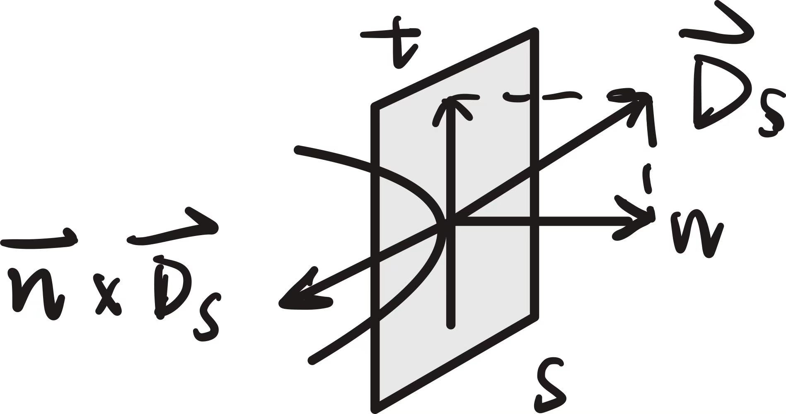

# 电磁场

## 场论

### Chapter 1：场及其表述方法

**1.1 场的定义：**
- 如果在空间中的每一点上都存在一个物理量，就称在这个空间存在该物理量的场。
- 场分为标量场与矢量场，分别用以空间坐标变量的标量函数与矢量函数表示。
- 产生场的源也分为两类：标量源与矢量源。
- 对于不同分布特性的场，采用合适的坐标系表述和分析可能会使问题得到大大简化，如三维空间分布的问题可能会变成一个平面求解的问题，或变为一条直线上求解的问题；
- 相反，若选用的坐标系不合适，则可能会使简单问题复杂化。

**1.2 不同坐标系表示：**
1. 直角坐标系：$(x, y, z)$
2. 柱坐标系：$(r, \alpha, z)$
3. 球坐标系：$(r, \theta, \alpha)$

**坐标系的选择和简化：**
- **轴对称场**：柱坐标系
  $\rightarrow$ 以对称轴为 $z$ 轴，矢量与 $\alpha$ 无关。
- **同心球壳**：简化为一维场，只与 $R$ 有关。
- **非同心球壳**：二维轴对称场域，柱坐标系。
- **无限长导线**：二维平行平面场。

**1.3 矢量的表示方法和运算：**
$$ \vec{A}(x,y,z) = \underbrace{A_x(x,y,z)\vec{i}}_{\text{坐标分量}} + \underbrace{A_y(x,y,z)\vec{j} + A_z(x,y,z)\vec{k}}_{\text{坐标分矢量}} $$

定义：$\vec{A}^\circ = \frac{\vec{A}}{|\vec{A}|}$ 为单位矢量。

**矢量叉积 (Cross Product)：**
$$ \vec{A} \times \vec{B} = \vec{e}_n |\vec{A}||\vec{B}|\sin\theta_{AB} $$
右手定则判断方向：
 
$|\vec{A} \times \vec{B}|$ 为 $\vec{A}, \vec{B}$ 构成平行四边形的面积。
又：
$$ \vec{A} \times \vec{B} = \begin{vmatrix} \vec{e}_x & \vec{e}_y & \vec{e}_z \\ A_x & A_y & A_z \\ B_x & B_y & B_z \end{vmatrix} $$
满足：$\vec{A} \times \vec{B} = -\vec{B} \times \vec{A}$

**1.4 矢径：** 源点指向场点的距离矢量。

**1.5 描述场分布的方法：**
- 二维：等值线
- 三维：等值面
$$ h(x,y,z) = \text{const} $$
**力线：** 矢量场的矢量线，其切向是场方向。
$$ \vec{A} \times d\vec{l} = 0 \quad (\text{d}\vec{l}\text{ 矢量线}) $$
- 二维场：$\frac{A_x(x,y)}{dx} = \frac{A_y(x,y)}{dy}$
- 三维场：$\frac{A_x}{dx} = \frac{A_y}{dy} = \frac{A_z}{dz}$

---

### Chapter 2：矢量场的散度与散度方程

物理世界共有两种产生矢量场的源：
- **标量源**（例如电荷密度 $\rho$）
- **矢量源**（例如电流密度 $\vec{J}$）

散度表述场与标量源的关系，旋度表述场与矢量源的关系。
> *注：实际上，“源”的定义是由数学中的散度和旋度产生的。*

**散度：** 通量的体密度。
**通量：** 矢量在有向曲面上的积分。
$$ \Phi = \iint_S \vec{Q} \cdot d\vec{S} $$
**闭合面通量：** $\Phi = \oiint_S \vec{Q} \cdot d\vec{S} = q$
由高斯通量定理，$\Phi = \text{面内总源}$。

**散度的定义和运算形式：**
$$ \text{div} \vec{Q} = \lim_{\Delta V \to 0} \frac{\Delta \Phi}{\Delta V} = \lim_{\Delta V \to 0} \frac{\iiint_{\Delta V} \rho(x,y,z) dV}{\Delta V} = \rho(x,y,z) $$

直角坐标系下：
$$ \text{div} \vec{Q} = \nabla \cdot \vec{Q} = \frac{\partial Q_x}{\partial x} + \frac{\partial Q_y}{\partial y} + \frac{\partial Q_z}{\partial z} $$
柱坐标系下：
$$ \nabla \cdot \vec{Q} = \frac{1}{r}\frac{\partial}{\partial r}(rQ_r) + \frac{1}{r}\frac{\partial Q_\alpha}{\partial \alpha} + \frac{\partial Q_z}{\partial z} $$
球坐标系下：
$$ \nabla \cdot \vec{Q} = \frac{1}{r^2}\frac{\partial}{\partial r}(r^2 Q_r) + \frac{1}{r\sin\theta}\frac{\partial (Q_\theta\sin\theta)}{\partial \theta} + \frac{1}{r\sin\theta}\frac{\partial Q_\alpha}{\partial \alpha} $$

静态的标量源的矢量场是保守场。因为标量源无旋，没有方向性，绕一圈积分一定为 0，即 $\oint_l \vec{Q} \cdot d\vec{l} = 0$，表现为不做功。

**高斯公式：** 
$$ \iiint_V \nabla \cdot \vec{Q} dV = q = \oiint_S \vec{Q} \cdot d\vec{S} $$

**电场中：** 
$$ \iiint_V \nabla \cdot \vec{E} dV = \frac{q}{\varepsilon_0} = \underbrace{\oiint_S \vec{E} \cdot d\vec{S}}_{\text{常见的公式}} $$
$\rightarrow \nabla \cdot \vec{E} = \frac{\rho}{\varepsilon_0}$ , $\nabla \cdot \vec{D} = \rho$

---

### Chapter 3：矢量场的旋度和旋度方程

**旋度：** 环量的面密度 (max)。
**环量：** $\Gamma = \oint_l \vec{H} \cdot d\vec{l} = \sum I_i$
环量源就是矢量源的通量（$\iint_S \vec{J} \cdot d\vec{S} = I_{net}$）。在磁场中，电流密度 $\vec{J}$ 就是矢量源。

环量源不变 ($I_{net} = \text{const}$)，环量不变。对于纯矢量源，需要满足连续性：
1. 定义域有限
2. 边界无法向分量
3. 总通量处处相等（对应电流连续性方程）
     
    $\Rightarrow$ 对场域内任一闭曲面，通量 $\oiint_S \vec{J} \cdot d\vec{S} = 0$ 
    $\Rightarrow$ 无标量源，无散 $\nabla \cdot \vec{J} = 0$

对于小环路，环量 $\Gamma = \oint_l \vec{H} \cdot d\vec{l}$ 与 $\vec{l}$ 所在平面的法向夹角有关，利用最大环量得到旋度的概念：

**旋度定义：**
$$ \text{curl} \vec{H} = \lim_{\Delta S \to 0} \frac{\Delta \Gamma}{\Delta S} = \lim_{\Delta S \to 0} \frac{\oint_l \vec{H} \cdot d\vec{l}}{\Delta S} $$
旋度的模即为最大环量面密度，方向为 $\vec{J}$ 方向。

**计算形式：**
$$ \text{curl} \vec{H} = \nabla \times \vec{H} = \begin{vmatrix} \vec{i} & \vec{j} & \vec{k} \\ \frac{\partial}{\partial x} & \frac{\partial}{\partial y} & \frac{\partial}{\partial z} \\ Q_x & Q_y & Q_z \end{vmatrix} $$

**斯托克斯公式：**
$$ \iint_S (\nabla \times \vec{H}) \cdot d\vec{S} = \oint_l \vec{H} \cdot d\vec{l} $$
由于 $\nabla \times \vec{H} = \vec{J}$，本质就是 **环量 = 矢量源的总通量**。

且：$\nabla \cdot (\nabla \times \vec{H}) = \nabla \times (\nabla \vec{Q}) = 0$ （$\leftarrow \nabla \vec{Q}$ 指标量场的梯度）

**磁场中：** 安培定理 
$$ \oint_l \vec{H} \cdot d\vec{l} = \iint_S \vec{J} \cdot d\vec{S} \quad \rightarrow \quad \nabla \times \vec{H} = \vec{J} $$

---

**小结 - 可解问题：**

**① 已知散度方程：**
$$ \nabla \cdot \vec{Q} = \frac{\partial Q_x}{\partial x} + \frac{\partial Q_y}{\partial y} + \frac{\partial Q_z}{\partial z} = \rho(x,y,z) \quad (\text{已知}) $$
三个未知函数一个方程，无法解出。

**② 已知旋度方程：**
$$ \nabla \times \vec{H} = \vec{J} \; (\text{已知}) \Rightarrow \begin{cases} \frac{\partial H_z}{\partial y} - \frac{\partial H_y}{\partial z} = J_x \\ \frac{\partial H_x}{\partial z} - \frac{\partial H_z}{\partial x} = J_y \\ \frac{\partial H_y}{\partial x} - \frac{\partial H_x}{\partial y} = J_z \end{cases} $$
这三个方程并不互相独立，还是无法解出。
**Proof:** 若 $\vec{H}_0$ 是其解，另有标量场 $\Phi$。
 对于 $\vec{\Phi}$ 有 $\nabla \times (\nabla \vec{\Phi}) = 0$
 则 $\vec{H}_{new} = \vec{H}_0 + \nabla \vec{\Phi}$ 也有：
 $\nabla \times \vec{H}_{new} = \vec{J} + 0 = \vec{J}$
 则由于 $\nabla \vec{\Phi}$ 是任取的，有无数个解。

**注释：$\nabla \Phi$为梯度；$\nabla\cdot\Phi$为散度；梯度是矢量！**

---

### Chapter 4：矢量场的边值问题与求解

**方向导数与梯度：**
沿 $l$ 的方向导数 $\frac{\partial f}{\partial l}$。梯度是方向导数的最大值。
记 $\nabla f = \frac{\partial f}{\partial x}\vec{i} + \frac{\partial f}{\partial y}\vec{j} + \frac{\partial f}{\partial z}\vec{k}$
有 $\frac{\partial f}{\partial l} = \nabla f \cdot \vec{l}^\circ$
$\bigstar \  \nabla \times \nabla f = 0$，环路积分为必为0 (保守场)。
**梯度与等值线(面)垂直。**

**亥姆霍兹定理** —— 唯一确定矢量函数形式的微分方程组

1) $\nabla \cdot \vec{Q} = \rho$，$\rho$ 为已知函数。
   则若 $\vec{Q}_1$ 满足方程，则：$\vec{Q}_2 = \vec{Q}_1 + \nabla \times \vec{A}$
   $\vec{A}$ 为任意矢量函数，则由于 $\nabla \cdot (\nabla \times \vec{A}) = 0$
   则 $\vec{Q}_2$ 都是方程的解。

2) $\nabla \times \vec{Q} = \vec{J}$，$\vec{J}$ 为已知函数。
   $\vec{Q}_2 = \vec{Q}_1 + \nabla \psi$，$\psi$ 为任意标量函数。
   由于 $\nabla \times (\nabla \psi) = 0$，则 $\vec{Q}_2$ 都是方程的解。

3) $\begin{cases} \nabla \cdot \vec{Q} = \rho \\ \nabla \times \vec{Q} = \vec{J} \end{cases} \Rightarrow$ $\vec{Q}$ 的形式一定。

4) 一个矢量函数可以用一个标量函数的梯度和一个矢量函数的旋度叠加来表示：
   $$ \vec{Q} = -\nabla\varphi + \nabla\times\vec{A} $$

---

**边界条件：** 场域外围边界 $S$ 上的已知量，用来给出定解或特解。
在 $S$ 的各处给定 $\vec{Q}$ 的切向 $\vec{Q}_t$法向 $\vec{Q}_n$。
若场分布在整个空间，称开域问题或开域场：
$$ \begin{cases} \nabla \cdot \vec{Q} = \rho \\ \nabla \times \vec{Q} = \vec{J} \\ Q_t(\vec{r})|_{r \to +\infty} = 0 \end{cases} $$

**列写步骤：**
**Step 1:** 散度、旋度方程；
**Step 2:** 选择边界条件的类型：
- **标量场：**
  1) Dirichlet 条件：直接给值。 e.g. $\phi(\vec{r}) = f(\vec{r})$
  2) Neumann 条件：边界上的法向导数。 e.g. $\frac{\partial \phi}{\partial n} = -\frac{\rho_s}{\varepsilon}$
  3) 混合式
- **矢量场：**
  1) 切向约束：$\vec{n} \times \vec{Q} = \vec{f}_1$ $\rightarrow$ 切向代矢量，与切向矢量大小相同方向垂直。
  2) 法向约束：$\vec{n} \cdot \vec{Q} = f_2$ $\rightarrow$ 法向矢量的模。
  
  **Step 3:** 代入分界面条件。

---

**不同介质的分界面条件：**

**A. 切向边界条件：**
描述界面两侧场量平行于界面方向的连续性。
$$ \begin{cases} E_{1t} = E_{2t} & \text{连续} \\ H_{1t} - H_{2t} = J_S & \text{有电流则突变} \end{cases} $$

**Proof:** (见上图矩形环路)

$\oint_l \vec{E} \cdot d\vec{l} = -\frac{d\Phi}{dt}$ 。由于 $w \to 0$ ，面积 $\Phi=0$，所以 $E_{1t} = E_{2t}$ 。
$\oint_l \vec{H} \cdot d\vec{l} = I + \frac{d\Psi}{dt}$ ，因为 $S \to 0$ $\Psi=0$ ，$H_{1t} - H_{2t} = J_S$  (界面)。

**B. 法向边界条件：**
描述界面两侧场量垂直于界面方向的连续性。
$$ \begin{cases} B_{1n} = B_{2n} & \text{连续} \\ D_{1n} - D_{2n} = \rho_S & \text{有电荷则突变} \end{cases} $$

**Proof:** (见上图扁平圆柱体/高斯面)

高斯定律： $\oiint_S \vec{B} \cdot d\vec{S} = 0$  (无单极子) $\Rightarrow (B_{1n} - B_{2n})S = 0$ ($dh \to 0$ )。
$\oiint_S \vec{D} \cdot d\vec{S} = q_{in} \Rightarrow (D_{1n} - D_{2n})S = q_{in}$ 。

---

**标量源 $\rho$ 的场**

**1. 显示函数通解法：**
 **矢量恒等式：**
 $\vec{A} \times (\vec{B} \times \vec{C}) = \vec{B}(\vec{A} \cdot \vec{C}) - \vec{C}(\vec{A} \cdot \vec{B})$

$$ \begin{cases} \nabla \cdot \vec{D} = \rho & \in V \quad (1)\\ \nabla \times \vec{D} = 0 & \in V \quad (2) \end{cases} $$
由 (2) 两边求旋度：
$\nabla \times \nabla \times \vec{D} = \nabla(\nabla \cdot \vec{D}) - \nabla^2 \vec{D} = 0$ (等式3)
由 (1) 两边求梯度，并结合(3)：
$\nabla(\nabla \cdot \vec{D}) = \nabla\rho$ (等式5)
（注：$\nabla^2 = \frac{\partial^2}{\partial x^2} + \frac{\partial^2}{\partial y^2} + \frac{\partial^2}{\partial z^2}$）

则可得矢量泊松方程：
**$\nabla^2 \vec{D} = \nabla\rho$**  （e.g., 电荷与电场，$\nabla^2 \vec{D} = \nabla\rho$）
$\bigstar$ **注意：** 由于(1)到(4)忽略了积分常数，对 $\rho$ 求不定积分时不要有常数 $C$！

**2. 积分形式通解法：**
对于一般方程：$\begin{cases} \nabla \cdot \vec{D} = \rho & \in V \\ \nabla \times \vec{D} = 0 & \in V \end{cases}$，$V$ 边界为 $S$
则一种通解形式为 (Helmholtz's Theorem):
$$ \vec{D}(\vec{r}) = \iiint_V \frac{\rho(\vec{r}')}{4\pi R^2} \vec{R}^\circ dV' - \frac{1}{4\pi}\oiint_S \left\{ [\vec{n} \times \vec{D}(\vec{r}')] \times \vec{R}^\circ \frac{1}{R^2} + [\vec{n} \cdot \vec{D}(\vec{r}')] \frac{1}{R^2} \vec{R}^\circ \right\} dS' $$

**公式理解，场的分解：**
1) $\iiint_V \frac{\rho(\vec{r}')}{4\pi R^2} \vec{R}^\circ dV'$ $\Rightarrow$ **源的贡献** ($R$为积分变量)。
   如果在真空中只有源，那么仅有这一项。
   $\frac{1}{4\pi R^2}$ 的含义：绕每个源点作过 $r$ 处的球壳，半径为 $R$。
   $d\Phi = \oiint_S d\vec{D}(\vec{r}) \cdot d\vec{S} = 4\pi R^2 |d\vec{D}(\vec{r})| \cdot \vec{R}^\circ = \rho(\vec{r}')dV'$ (注：$r'$为源到原点的矢径)。
   $\vec{D}(\vec{r})$ 是所有 $d\vec{D}(\vec{r})$ 的累计：
   $$ \vec{D}(\vec{r}) = \int d\vec{D}(\vec{r}) = \iiint_V \frac{\rho(\vec{r}')}{4\pi R^2} \vec{R}^\circ dV' $$

2) $\frac{1}{4\pi}\oiint_S \left\{ [\vec{n} \times \vec{D}(\vec{r}')] \times \vec{R}^\circ \frac{1}{R^2} + [\vec{n} \cdot \vec{D}(\vec{r}')] \frac{1}{R^2} \vec{R}^\circ \right\} dS'$
   $\Rightarrow$ **边界约束**。边界外源的作用在边界上的体现。
   $\vec{n} \times \vec{D}(\vec{r}') \Rightarrow$ “电流”效应 $\leftarrow$ 切向约束。
   $\vec{n} \cdot \vec{D}(\vec{r}') \Rightarrow$ “电荷”效应 $\leftarrow$ 法向约束。

3) **贡献 + 约束 = 总分布**
实际中边值问题只给出了 $\vec{n} \cdot \vec{D}$ 或 $\vec{n} \times \vec{D}$。
$\Rightarrow$ 先由边界积分方程求解出 $\vec{n} \cdot \vec{D}$ 和 $\vec{n} \times \vec{D}$ 两个。

**边界积分方程：**
由通解形式，先求源的体积分 $\vec{D}_{sp}$。
让 $\vec{D}(\vec{r})$ 中的 $\vec{r}$ 表示边界 $S$ 上的一点。
则有：$\vec{D}_S = \vec{D}_{sp} + \text{边界约束项}$
$\vec{D}_S$ 分解：$\vec{D}_S = (\vec{n} \times \vec{D}_S) \times \vec{n} + (\vec{n} \cdot \vec{D}_S) \cdot \vec{n}$
即 $\vec{D}_{st}$ 和 $\vec{D}_{sn}$。

于是得到只与 $(\vec{n} \times \vec{D}_S)$ 和 $(\vec{n} \cdot \vec{D}_S)$ 相关项：
$$ (\vec{n} \times \vec{D}_S) \times \vec{n} + (\vec{n} \cdot \vec{D}_S) \vec{n} - \vec{D}_{sp} + \frac{1}{4\pi}\oiint_S (\vec{n} \times \vec{D}_S) \times \vec{R}^\circ \frac{1}{R^2} dS' + \frac{1}{4\pi}\oiint_S (\vec{n} \cdot \vec{D}_S) \vec{R}^\circ \frac{1}{R^2} dS' = 0 $$
**核心原理：**
**原通解本身含有对边界场分布的描述，而边界条件实际是对边界场的正交分解。**

---

**矢量源 $\vec{J}$ 的场：**
一般方程：
$$ \begin{cases} \nabla \times \vec{H} = \vec{J} \\ \nabla \cdot \vec{H} = 0 \end{cases} $$
同样的，有两种解法。

**1. 显示函数通解法：**
$\nabla(\nabla \cdot \vec{H}) - \nabla^2 \vec{H} = \nabla \times \vec{J}$
代入得：**$\nabla^2 \vec{H} = -\nabla \times \vec{J}$**
这是矢量源的矢量泊松方程。

**2. 积分形式通解法：**
$$ \vec{H}(\vec{r}) = \iiint_V \frac{\vec{J}(\vec{r}') \times \vec{R}^\circ}{4\pi R^2} dV' - \frac{1}{4\pi}\oiint_S \left[ (\vec{n} \times \vec{H}) \times \vec{R}^\circ \frac{1}{R^2} + (\vec{n} \cdot \vec{H}) \frac{1}{R^2} \vec{R}^\circ \right] dS' $$
**体积分项：** $\iiint_V \frac{\vec{J}(\vec{r}') \times \vec{R}^\circ}{4\pi R^2} dV'$
**原理：毕奥-萨伐尔定律**
电流元产生的磁场 $d\vec{B} = \frac{\mu_0}{4\pi} \cdot \frac{Id\vec{l} \times \vec{R}^\circ}{R^2}$
在 $V$ 区域里存在电流元，在 $V$ 中离原点 $\vec{r}'$ 处。
所有磁场积分 $\int d\vec{H} = \iiint_V \frac{1}{4\pi} \cdot \frac{\vec{J}(\vec{r}') \cdot dS \cdot d\vec{l} \times \vec{R}^\circ}{R^2}$
$$ \vec{H}(\vec{r}) = \iiint_V \frac{\vec{J}(\vec{r}') \times \vec{R}^\circ}{4\pi R^2} dV' $$
($\vec{R}$ 为待求点到电流元的距离矢量)

---

### Chapter 5：矢量场的位函数

**一、标量源无旋场的标量位**

**1. 标量位 $\varphi$ 的引入及其满足的泊松方程**
一般方程：$\begin{cases} \nabla \cdot \vec{E} = \rho / \varepsilon \\ \nabla \times \vec{E} = 0 \end{cases}$
由于梯度的旋度为 0，考虑引入 $\varphi$。
则 $\nabla \times \nabla\varphi = 0 \Rightarrow \vec{E} = -\nabla\varphi$ （正负都可以）
所有 $\varphi$ 都满足 $\nabla \times \vec{E} = 0$，$\varphi$ 由方程 $\nabla \cdot (-\nabla\varphi) = -\nabla^2\varphi = -\rho/\varepsilon$ 约束。
称 **$\nabla^2\varphi = -\rho/\varepsilon$** 为泊松方程。
差一个积分常数 $C$ 的 $\varphi$ 都满足该方程，因此 $\varphi$ 需要指定参考点才能唯一确认。

**标量位 $\varphi$ 的边界条件：**
- 法向边界条件：$\vec{n} \cdot \vec{E} = -\vec{n} \cdot \nabla\varphi = -\frac{\partial \varphi}{\partial n}$
- 切向边界条件：$|\vec{n} \times \vec{E}| = \frac{\partial \varphi}{\partial t}$

**2. $\varphi$ 边界条件的扩展：**
1) **法向边界条件 $\Rightarrow$ 通量条件**
   $\iint_S \vec{E} \cdot d\vec{S} = -\iint_S \frac{\partial \varphi}{\partial n} dS = q/\varepsilon$
   则 $-\frac{\partial \varphi}{\partial n} = \frac{\rho_S}{\varepsilon}$ ，$\rho_S$ 为面电荷密度。
   **即 Neumann 条件。**
2) **切向边界条件 $\Rightarrow$ 齐次时**
   $\frac{\partial \varphi}{\partial t} = 0 \Rightarrow$ 边界面是等位面。
   则 $\varphi = C_1$，**即 Dirichlet 条件。**

一般地，边界上的 $\varphi$ 值为待求量，其上的电荷 $\rho_S$ 为已知量，是 Neumann 条件。

**综合两者，可得：**
$$ \begin{cases} \nabla^2 \varphi = -\rho/\varepsilon & \in V \quad \ (\text{泊松方程}) \\ \varphi = C_{om} & \in S_1 \quad (\text{参考点 Dirichlet}) \\ \varphi = C_i & \in S_f \quad (\text{未知 Dirichlet}) \\ \frac{\partial \varphi}{\partial n} = -\frac{\rho_s}{\varepsilon} & \in S_f \quad (\text{定解条件 Neumann}) \\ \frac{\partial \varphi}{\partial n} = 0 & \in S_2 \end{cases} $$

**3. 位函数边值问题的解法**
1) **显示函数通解法**
   主要推导 2D 情形：$\varphi(x,y) = \varphi_x(x)\varphi_y(y)$ (分别沿$x, y$向导数)
   要连续，满足 Laplace 方程：
   $$ \frac{\partial^2 \varphi(x,y)}{\partial x^2} + \frac{\partial^2 \varphi(x,y)}{\partial y^2} = 0 $$
   同除 $\varphi_x(x)\varphi_y(y)$：
   $$ \frac{1}{\varphi_x}\frac{\partial^2 \varphi_x}{\partial x^2} + \frac{1}{\varphi_y}\frac{\partial^2 \varphi_y}{\partial y^2} = 0 $$
   > 设常数 $k$，有：
   > $\frac{1}{\varphi_x}\frac{\partial^2 \varphi_x}{\partial x^2} = k , \quad \frac{1}{\varphi_y}\frac{\partial^2 \varphi_y}{\partial y^2} = -k$
   
   两个常微分方程可求出通解。

2) **积分形式通解法**
   $$ \varphi = \frac{1}{\varepsilon}\nabla \cdot \vec{D}, \quad \varphi(\vec{r}) = \iiint_V \frac{\rho(\vec{r}')}{4\pi \varepsilon R} dV' - \frac{1}{4\pi}\oiint_S \left[ \varphi(\vec{r}')\frac{\partial}{\partial n}\left(\frac{1}{R}\right) - \frac{\partial \varphi(\vec{r}')}{\partial n} \frac{1}{R} \right] dS' $$
   式中 $\varphi(\vec{r}')$ 对应 Dirichlet 条件，$\frac{\partial \varphi(\vec{r}')}{\partial n}$ 对应 Neumann 条件。

---

**二、矢量源无散场的矢量位**

**1. 矢量位 $\vec{A}$ 的引入及其满足的方程**
$$ \begin{cases} \nabla \times \vec{B} = \mu\vec{J} \\ \nabla \cdot \vec{B} = 0 \end{cases} \Rightarrow \vec{B} = \nabla \times \vec{A} \; (\text{无散}) $$
则 $\nabla \times \nabla \times \vec{A} = \mu\vec{J}$。
由亥姆霍兹定理：$\vec{A}' = \vec{A} + \nabla\psi$ 都满足。
为了唯一的 $\vec{A}$，规定 $\nabla \cdot \vec{A} = 0$。
称 $\nabla \cdot \vec{A} = 0$ 为**库仑规范**。
则 $\vec{A}$ 满足：
$$ \begin{cases} \nabla \times \nabla \times \vec{A} = \mu\vec{J} \\ \nabla \cdot \vec{A} = 0 \end{cases} $$
称 $\vec{A}$ 为 $\vec{B}$ 的矢量位函数。

又 $\nabla \times (\nabla \times \vec{A}) = \nabla(\nabla \cdot \vec{A}) - \nabla^2\vec{A} = \mu\vec{J}$
又 $\nabla \cdot \vec{A} = 0$，
则 **$\nabla^2\vec{A} = -\mu\vec{J}$**
此为矢量位 $\vec{A}$ 满足的矢量泊松方程。
$$ \nabla^2\vec{A} = -\mu\vec{J} \Rightarrow \begin{cases} \nabla^2 A_x = -\mu J_x \\ \nabla^2 A_y = -\mu J_y \\ \nabla^2 A_z = -\mu J_z \end{cases} $$
(2) 解法略

---

## 电磁场

### Chapter 1： 静止电荷的电场

**1.1 电场强度 $\vec{E}$ 与 Coulomb 定律**
$\vec{E}$ 定义为位于该点静止的单位正电荷所受的电场力。
$$ \vec{E} = \frac{\vec{F}}{q} $$

自由空间中静电场的边值问题：
$$ \begin{cases} \nabla \cdot \vec{E}(\vec{r}) = \rho(\vec{r})/\varepsilon_0 \\ \nabla \times \vec{E}(\vec{r}) = 0 \\ E_t(\vec{r})|_{r \to \infty} = 0 \end{cases} $$
真空介电常数 $\varepsilon_0 = \frac{10^{-9}}{36\pi} \; \text{F/m}$

**积分形式：**
$$ \begin{cases} \oiint_S \vec{E} \cdot d\vec{S} = \frac{1}{\varepsilon_0} q_{net}
\\ \\ \oint_l \vec{E} \cdot d\vec{l} = 0 \end{cases} $$

**积分形式通解：**
$$ \vec{E}(\vec{r}) = \iiint_V \frac{\rho(\vec{r}')}{4\pi\varepsilon} \nabla'\frac{1}{R} dV' - \frac{1}{4\pi} \left\{ \oiint_S \vec{n} \cdot \vec{E}(\vec{r}') \nabla'\frac{1}{R} dS + \oiint_S [\vec{n} \times \vec{E}(\vec{r}')] \times \nabla'\frac{1}{R} dS \right\} $$

**解读：**
$\vec{r}'$：源点的矢径；
$\vec{r}$：场点的矢径（待求点）；
$\vec{R}$：场源间距，$R = |\vec{r} - \vec{r}'|$；
$\nabla'$：对源点求梯度；
$\nabla'\frac{1}{R} = \nabla'\frac{1}{|\vec{r}-\vec{r}'|} = -\nabla\frac{1}{R}$。

**扩充内容：** 已知 $\vec{E} = E_p(\vec{r})\vec{r}^\circ$，在导体面上 $\vec{n} \times \vec{E} = 0$，$\vec{n} \cdot \vec{E}$ 均匀分布。

内部电场： 
$$\vec{E}_n(b) = \underbrace{ \vec{n} \cdot \vec{E}_p(b) }_{\text{源电场}} - \underbrace{ \frac{1}{4\pi}\vec{n} \cdot \oiint_S E_n(\vec{r}') \frac{\vec{R}^\circ}{R^2} dS' }_{\text{感应电荷贡献 = 0 （由球的对称性）}} $$
$$E_n(b) = \vec{n} \cdot \vec{E}_p(b) = \frac{q}{4\pi\varepsilon_0 b^2}$$
**结论：** 导体球壳不影响内部场！
$\Rightarrow$ **静电屏蔽**

---

**库仑定律：**
由边值问题的通解，自由空间静电场边值问题的解为：
$$ \vec{E}(\vec{r}) = \iiint_{V'} \frac{\rho(\vec{r}')}{4\pi\varepsilon_0 R^2} dV' \vec{R}^\circ $$

微元化，点电荷场强：
$$ \vec{E}(\vec{r}) = \frac{q}{4\pi\varepsilon_0 |\vec{r}-\vec{r}'|^2} \vec{e}_R $$
面电荷有：$\vec{E}(\vec{r}) = \frac{1}{4\pi\varepsilon_0} \iint_{S'} \frac{\rho_S(\vec{r}')dS'}{|\vec{r}-\vec{r}'|^2} \vec{e}_R$
线电荷有：$\vec{E}(\vec{r}) = \frac{1}{4\pi\varepsilon_0} \int_{l'} \frac{\tau(\vec{r}')dl'}{|\vec{r}-\vec{r}'|^2} \vec{e}_R$

**推论 - 常见电场** （此处 $\tau\Delta l \rightarrow q_{net}$）
带电直线中垂线：$E = \frac{\tau L}{4\pi\varepsilon_0 x (x^2 + L^2/4)^{1/2}}$
无限长直线 ($L \gg x$)：$E = \frac{\tau}{2\pi\varepsilon_0 x}$

> **高斯视角：** $2\pi x \cdot \Delta l \cdot E = \tau\Delta l$

球、板、环 ($x \gg R$)：退化为点电荷。

---

**1.2 高斯通量定理**
$$ \begin{cases} \oiint_S \vec{E} \cdot d\vec{S} = \frac{1}{\varepsilon_0} \iiint_V \rho dV = \frac{1}{\varepsilon_0} q_{net} \\ \oint_l \vec{E} \cdot d\vec{l} = 0 \end{cases} $$

全息思想：测量边界来求内部源。
平方反比的实质：三维空间球面面积的几何约束 ($4\pi R^2$)。
