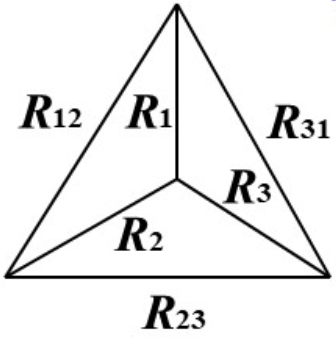
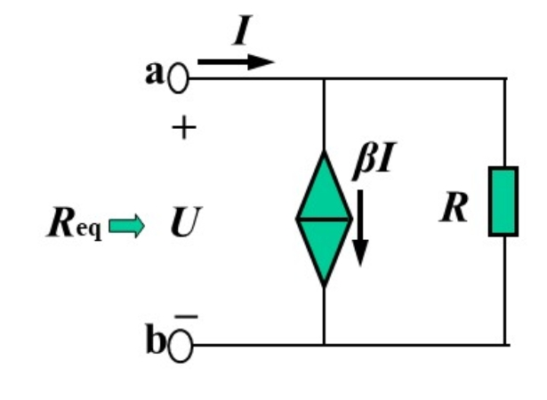
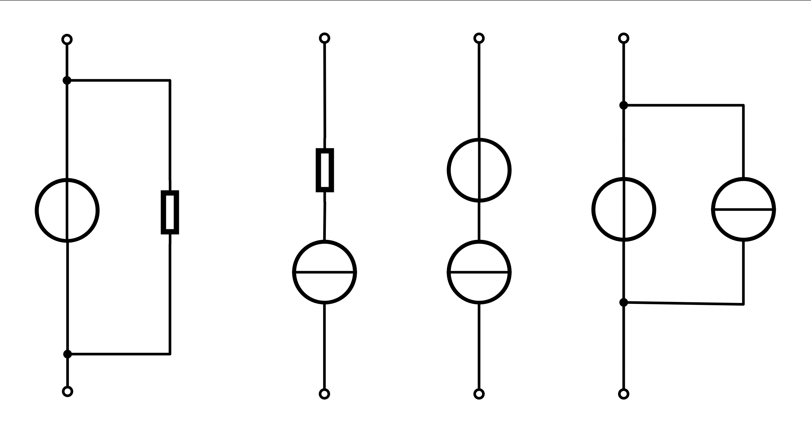
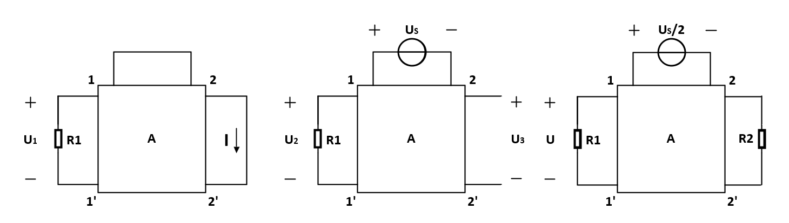

# 1. 电路基本知识

## 1.1 端口（Port）

端口是指由一对端子（或节点）组成的、用于与外部电路进行能量交换或信号传输的入口。

一个“端子对”要被称为“端口”，必须满足**端口条件（Port Condition）**：

- **电流相等条件**：从其中一个端子流入的电流，必须**等于**从另一个端子流出的电流。

> [!CAUTION]
> 虽然线性受控源常常在电路中表示为这样：
>
> 
>
> 
>
> 
>
> 但实际上受控源并不是二端口而是四端口，平时的画法简化了受控源的取样端，实际应该是这样：
>
> 
>
> 

## 1.2 Y-Δ变换

对于这样Y型或Δ型的三个电阻组成的电路，可以通过**Y-Δ变换**来互相转换，来实现电路的简化分析。

**对于Y->Δ：**
$$
R_{12} = R_1 + R_2 + \frac{R_1 R_2}{R_3}
$$
其它同理，便于记忆，可以认为等边三角形(Δ)上的电阻等于 **直接相连的Y电阻之和** 加上 **相邻Y电阻之积与对角Y电阻的比值**。

**对于Δ->Y：**
$$
R_1 = \frac{R_{12} R_{31}}{R_{12}+R_{23}+R_{31}} 
$$
其它同理，便于记忆，可以认为特定一个Y电阻等于 **共节点Δ电阻之积** 除以 **所有Y电阻之和**。

最特别的情况是**三个电阻都相等**时，**等效Δ电阻是Y电阻的三倍，等效Y电阻是Δ电阻的三分之一**。

> [!IMPORTANT]
>
> **等效永远是对端口等效，替换后对电路其他部分不会有任何影响，只是一种简化电路的手段。**

## 1.3 常用等效

#### 含受控源的二端口网络等效

对于这样一个电路，采用**加压求流**或**加流求压**来计算等效电阻。

图中是三极管放大电路等效模型的一部分，可以得到：
$$
R_{eq} = (1 - \beta) R
$$
这种类似的等效可以极大减少复杂电路中的计算量。

#### 电源相关的等效

**电压源串联**和**电流源并联**都相当于直接叠加。

对于有内阻的电源，电压源和电流源可以由欧姆定律来直接等效(对于受控源也可以)。

> [!IMPORTANT]
>
> 
>
> 上方这几种接法回导致元件**丧失作用**：第一、二种会使R无效，第三种会使电压源失效，第四种会使电流源失效。

## 1.4 重要定理

**齐性定理：** 在**有唯一解的线性电路**中，当电路中只有一个激励时（独立源），**响应与激励成正比**。

**叠加定理：** 在**线性电路**中，任意支路电流或电压都是电路中**各个独立源独立作用**时产生的电流或电压的代数和。

> [!IMPORTANT]
>
> 使用叠加原理时有**受控源**：把受控变量也看做叠加而成的，受**各个独立源分开作用**，分析时**只考虑独立源的作用**就可以，在每个不同独立源单独作用时的小电路中分析其效果，最后叠加即可。
>
> **不能叠加求功率！叠加定理不适用于非线性电路！**

**戴维南定理：** 一个任意复杂的**线性电路**，对于它的任意两个接线端（称为A、B端），可以等效为一个：

1. 一个独立电压源（等效电压源，称为Thevenin电压$V_{th}$ ）；
2. 一个与之串联的电阻（等效电阻，称为Thevenin电阻 $R_{th}$ ）。

**使用戴维南定理求解的方法**
 1. **计算 Vth**：
  - 将待等效的两端口断开，求解两端口间的开路电压，即为戴维南等效电压Vth。
 2. **计算 Rth**：
  - 将电源反映为其内阻（独立电压源短路，独立电流源开路），然后计算从两端口观察到的等效电阻（即两端的总电阻）。
 3. **简化电路**：
    - 将原来的复杂电路替换为一个电压为Vth，电阻为Rth 的等效电路。
 4. **继续分析或计算**：
    - 将实际负载接入简化后的戴维南等效电路，进行求解。

以上的三个定理都只适用于**线性电路**！**线性电路一定由线性元件组成**！**电容和电感也是线性元件**！

**替代定理：** 任意**有唯一解**的电路 **(线性、非线性均可)**，支路电压、电流已知时，可以用**对应电压或电流的电源**来替代该支路，替代后电路**工作点不变**。**（注意：u-i特性很有可能完全不一样，但是电路只要在同一工作点所有节点的状态都是一样的。）**

所有定理的综合运用可以参考下面这题：

> [!IMPORTANT]
>
> **2025年春电路原理期中压轴：**
>
> 如图所示电路中，网络 **A** 是由独立源、受控源和线性电阻构成的线性三端口网络。
>
> 
>
> 1.  **图 1**：当网络上方端口短路时，端口 $1-1'$ 上的电压为 $U_1$，端口 $2-2'$ 的短路电流为 $I$（方向如图所示）。
> 2.  **图 2**：当网络上方端口接电压源 $U_S$ 时，端口 $1-1'$ 上的电压为 $U_1$，端口 $2-2'$ 的开路电压为 $U_2$。
> 3.  **图 3**：当网络上方端口接电压源 $U_S/2$，且端口 $2-2'$ 接负载电阻 $R_2 = U_2/I$ 时，已知此时负载 $R_2$ 获得了最大功率。
>
> **求：** 图 3 中端口 $1-1'$ 上的电压 $U$。

**参考解法：**

**Step 1：** 对图1和图3分析

对图3：由于最大功率输出时负载 $R_2 = U_2/I$，所以从端口$2-2'$看整个电路，等效戴维南电阻为$R_2$；

对图1：戴维南等效电阻和图3是一样的，也是$R_2$，短路时由于$R_2 = U_2/I$，可知整个网络的戴维南等效电压为$U_2$；

